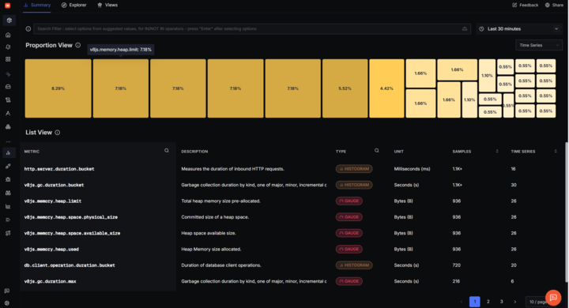
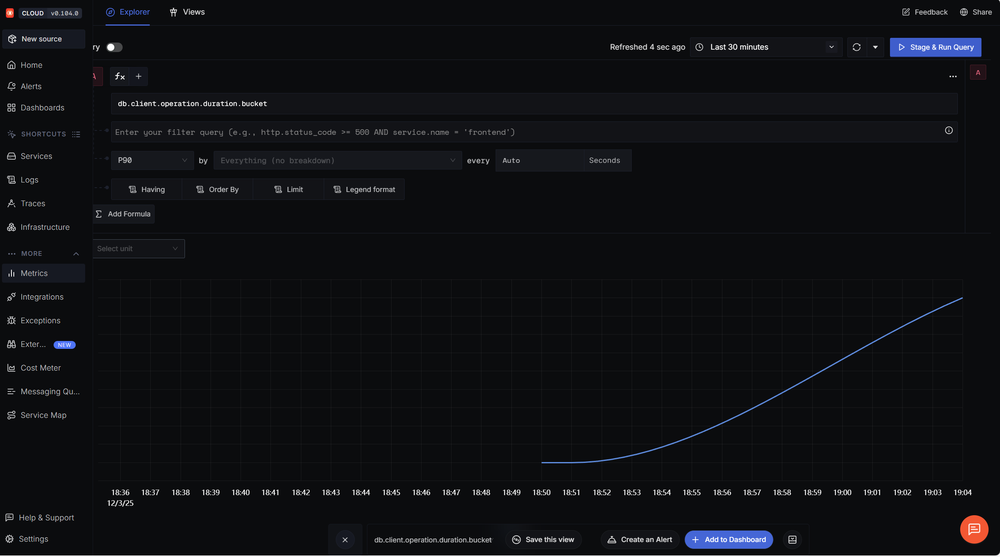

# SigNoz Metrics Integration

This document explains the SigNoz/OpenTelemetry integration for the
Conductor application, which provides observability through metrics,
traces, and logs.

## Overview

The application uses OpenTelemetry SDK to collect metrics and traces,
which are exported to SigNoz for visualization and analysis. This
integration is **embedded into the application code** (not standalone)
as required.

## Architecture

### Components

1. **`src/instrumentation.js`** - OpenTelemetry SDK initialization
   - Configures NodeSDK with auto-instrumentation for Express, HTTP, and PostgreSQL
   - Exports metrics and traces to SigNoz via OTLP protocol
   - Defines custom metrics for application-specific monitoring

2. **`src/middleware/metrics-middleware.js`** - Express middleware
   - Captures HTTP request metrics (count, duration, errors)
   - Provides tracking functions for business events (logins, DB queries, journal entries, etc.)

3. **`src/server.js`** - Integration point
   - Imports instrumentation FIRST (before any other modules)
   - Adds metrics middleware to Express app

### Custom Metrics

The integration tracks the following custom metrics:

| Metric Name | Type | Description |
| ----------- | ---- | ----------- |
| `http.requests` | Counter | Total HTTP requests by method, route, status |
| `http.request.duration` | Histogram | HTTP request latency in milliseconds |
| `user.logins` | Counter | User login events by status (success/failure) |
| `db.queries` | Counter | Database queries by operation type |
| `db.query.duration` | Histogram | Database query execution time |
| `api.errors` | Counter | API errors by type and endpoint |
| `active.sessions` | Gauge | Current number of active user sessions |
| `journal.entries` | Counter | Journal entries by role |
| `attendance.records` | Counter | Attendance records by status |

### Auto-Instrumentation

The following are automatically instrumented:

- **HTTP/HTTPS** - All incoming and outgoing HTTP requests
- **Express.js** - Middleware, route handlers, error handlers
- **PostgreSQL** - All database queries via `pg` library
- **File System** - File I/O operations

## Setup

### Prerequisites

- Node.js 18+ (already installed)
- PostgreSQL (already installed)
- SigNoz instance (local or cloud)

### Local SigNoz Setup (Docker)

1. **Install Docker Desktop for Windows**
   - Download from <https://www.docker.com/products/docker-desktop/>
   - Follow installation instructions

2. **Clone SigNoz repository**

   ```powershell
   cd $HOME
   git clone https://github.com/SigNozHQ/signoz.git
   cd signoz/deploy
   ```

3. **Start SigNoz**

   ```powershell
   docker compose -f docker/clickhouse-setup/docker-compose.yaml up -d
   ```

4. **Verify SigNoz is running**
   - Open browser to <http://localhost:3301>
   - Create an account (first user is admin)
   - SigNoz collector endpoint: <http://localhost:4318>

5. **Stop SigNoz** (when done)

   ```powershell
   docker compose -f docker/clickhouse-setup/docker-compose.yaml down
   ```

### Configuration

1. **Copy `.env.example` to `.env`** (if not already done)

   ```powershell
   Copy-Item .env.example .env
   ```

2. **Update `.env` with SigNoz settings**

   ```env
   # For local SigNoz
   SIGNOZ_ENDPOINT=http://localhost:4318
   SERVICE_NAME=conductor-app
   ENVIRONMENT=development
   ```

3. **For SigNoz Cloud** (if using cloud instead of local)

   ```env
   SIGNOZ_ENDPOINT=https://ingest.{region}.signoz.cloud:443
   SERVICE_NAME=conductor-app
   ENVIRONMENT=production
   SIGNOZ_ACCESS_TOKEN=your-access-token-here
   ```

## Usage

### Starting the Application

The metrics collection is automatic. Just start the server normally:

```powershell
npm run dev
```

or

```powershell
node src/server.js
```

The instrumentation will:

- Initialize on app startup
- Automatically track all HTTP requests
- Export metrics to SigNoz every 10 seconds
- Log initialization success/failure

### Viewing Metrics in SigNoz

1. Open SigNoz dashboard: <http://localhost:3301> (or your cloud URL)

2. Navigate to:
   - **Services** - See service health, latency, error rates
   - **Traces** - View distributed traces of requests
   - **Metrics** - Custom metrics dashboard
   - **Logs** - Application logs (if log ingestion configured)



*Figure 1: SigNoz Metrics Explorer showing all collected metrics including
HTTP server duration, database operations, memory usage, and garbage
collection metrics*

3. Create custom dashboards:
   - Use metric names like `http_requests`, `user_logins`, `db_queries`
   - Filter by labels: `method`, `route`, `status`, `role`, etc.
   - Set up alerts for anomalies



*Figure 2: Time series visualization of database client operation duration,
showing performance trends over time*

### Adding Custom Tracking

To track custom business events, import the tracking functions:

```javascript
import { 
  trackLogin, 
  trackDatabaseQuery, 
  trackJournalEntry, 
  trackAttendance 
} from './middleware/metrics-middleware.js';

// Example: Track login event
app.post('/auth/login', async (req, res) => {
  try {
    const user = await authenticateUser(req.body);
    trackLogin(user.email, 'success');
    res.json({ success: true });
  } catch (error) {
    trackLogin(req.body.email, 'failure');
    res.status(401).json({ error: 'Invalid credentials' });
  }
});

// Example: Track database query
app.get('/users', async (req, res) => {
  const startTime = Date.now();
  const users = await pool.query('SELECT * FROM users');
  trackDatabaseQuery('SELECT', Date.now() - startTime);
  res.json(users.rows);
});

// Example: Track journal entry
app.post('/journal', async (req, res) => {
  const entry = await createJournalEntry(req.body);
  trackJournalEntry(req.user.role); // 'student', 'instructor', 'TA', 'tutor'
  res.json(entry);
});

// Example: Track attendance
app.post('/attendance', async (req, res) => {
  const record = await markAttendance(req.body);
  trackAttendance(record.status); // 'present', 'absent', 'late'
  res.json(record);
});
```

## Monitoring Best Practices

### Key Metrics to Monitor

1. **Performance**
   - HTTP request duration (p50, p95, p99)
   - Database query duration
   - Error rate by endpoint

2. **Business Metrics**
   - Login success/failure ratio
   - Active sessions count
   - Journal entries per day
   - Attendance rate

3. **System Health**
   - Request throughput (requests/second)
   - Error rate (errors/total requests)
   - Database connection pool usage

### Setting Up Alerts

Create alerts in SigNoz for:

- Error rate > 5%
- Request latency p95 > 1000ms
- Login failures > 10/minute
- Database query duration p95 > 500ms

## Troubleshooting

### Metrics not appearing in SigNoz

1. **Check SigNoz is running**

   ```powershell
   docker ps
   ```

   Should show containers: `signoz-otel-collector`, `signoz-query-service`,
   `clickhouse`

2. **Verify endpoint configuration**
   - Check `.env` has `SIGNOZ_ENDPOINT=http://localhost:4318`
   - Ensure no firewall blocking port 4318

3. **Check application logs**

   ```text
   ✅ OpenTelemetry SDK initialized successfully
   🔍 Service: conductor-app
   📊 Exporting to: http://localhost:4318
   🌍 Environment: development
   ```

4. **Test connectivity**

   ```powershell
   curl http://localhost:4318/v1/metrics
   ```

### Instrumentation not loading

1. **Verify import order in server.js**
   - `import "./instrumentation.js";` MUST be the first import
   - Check for any imports before this line

2. **Check dependencies**

   ```powershell
   npm ls @opentelemetry/sdk-node
   ```

3. **Environment variables**
   - Ensure `SIGNOZ_ENDPOINT` is set
   - Check `SERVICE_NAME` and `ENVIRONMENT` are defined

### High memory usage

The OpenTelemetry SDK uses ~20-50MB of memory. If you see excessive usage:

1. **Reduce metric export frequency** (in `instrumentation.js`)

   ```javascript
   periodicExportingMetricReader: {
     exportIntervalMillis: 30000, // Change from 10s to 30s
   }
   ```

2. **Disable auto-instrumentation** for unused libraries

   ```javascript
   instrumentations: [
     getNodeAutoInstrumentations({
       '@opentelemetry/instrumentation-fs': { enabled: false },
     }),
   ],
   ```

## Production Deployment

### Environment Configuration

For production, update `.env`:

```env
NODE_ENV=production
ENVIRONMENT=production
SIGNOZ_ENDPOINT=https://ingest.{region}.signoz.cloud:443
SIGNOZ_ACCESS_TOKEN=your-production-token
SERVICE_NAME=conductor-app
```

### Performance Considerations

- Metrics collection adds ~1-5ms latency per request (negligible)
- Memory overhead: ~20-50MB
- Network: ~10KB/second to SigNoz (every 10 seconds)

### Security

- **Never expose SigNoz endpoint publicly** - Use firewall rules
- **Rotate access tokens** regularly (if using cloud)
- **Sanitize PII** from traces and metrics (email, passwords, etc.)


