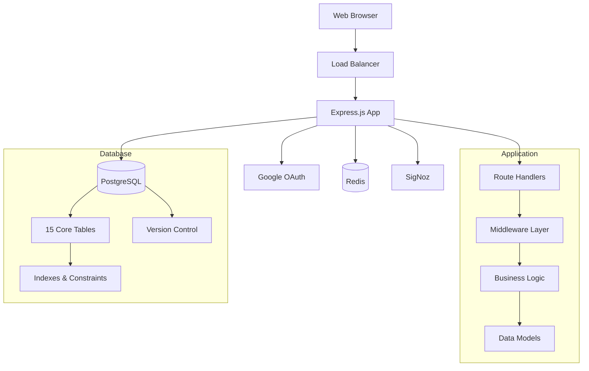
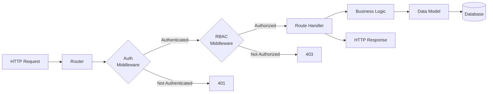
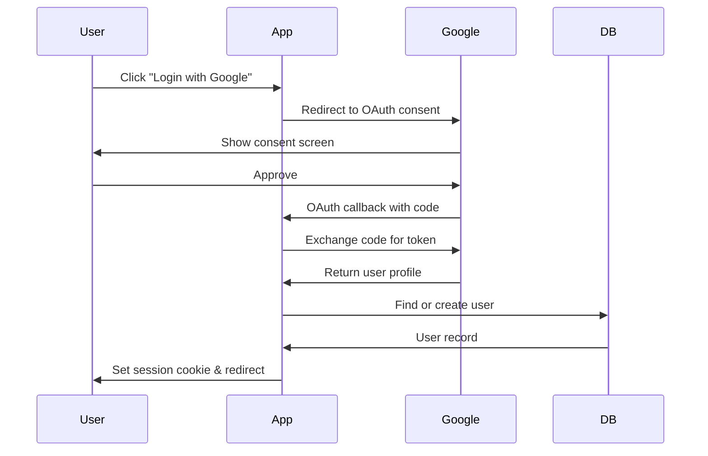
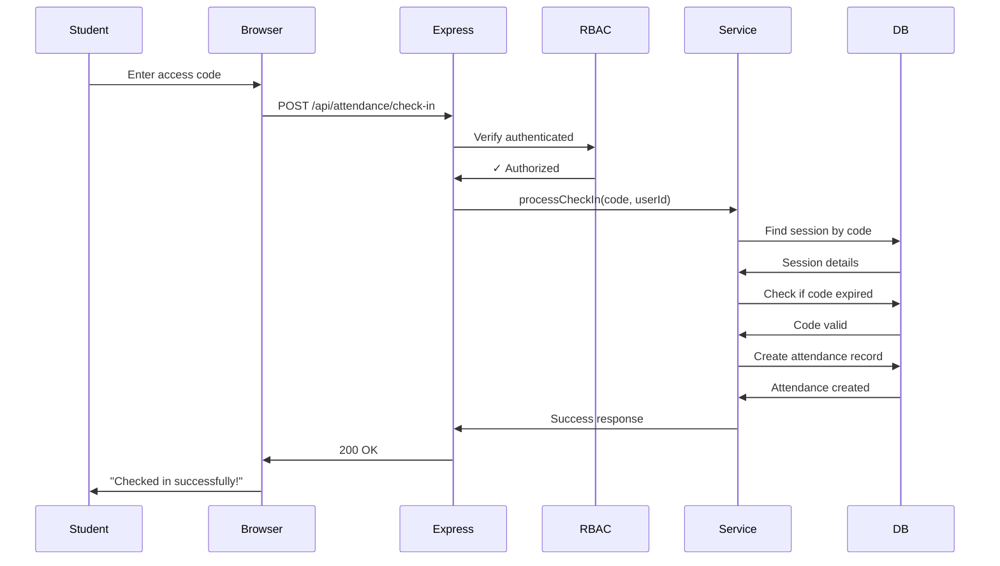

# System Architecture Overview

Comprehensive overview of the Conductor application architecture, design patterns, and data flow.

> **For technology details and selection rationale:** See [Tech Stack](tech-stack.md) and [ADRs](../adrs/)

## High-Level Architecture

Conductor is a **monolithic full-stack application** with a clear separation between frontend and backend layers, using PostgreSQL as the single source of truth.



## System Components

### 1. Frontend Layer

**Approach**: Server-rendered HTML with client-side JavaScript enhancements

- Server-side rendering for initial page load
- Client-side interactivity via vanilla JavaScript modules
- Responsive design with CSS Grid and Flexbox
- Theme system using CSS custom properties

**Key Features:**
- Role-based dashboards (6 variants: admin, instructor, professor, TA, tutor, student)
- Real-time attendance check-in
- Team management interface
- Journal entry system
- Announcement board
- Live statistics widgets

**Technology:** See [Tech Stack - Frontend](tech-stack.md#frontend-technologies) and [ADR-0005](../adrs/adr-0005-frontend-technology-selection.md)

### 2. Backend Layer

**Approach**: Layered architecture with clear separation of concerns



**Architectural Layers:**

1. **Routes** (`src/routes/`) - HTTP endpoint definitions
   - 18 route modules covering all resources
   - RESTful API design
   - Input validation

2. **Middleware** (`src/middleware/`)
   - Authentication verification
   - Permission checking (RBAC)
   - Error handling
   - Request logging and metrics

3. **Services** (`src/services/`)
   - Business logic implementation
   - Permission evaluation
   - Data validation rules
   - Complex calculations

4. **Models** (`src/models/`)
   - Database query abstraction
   - CRUD operations
   - Transaction management

**Technology:** See [Tech Stack - Backend](tech-stack.md#backend-technologies) and [ADR-0004](../adrs/adr-0004-server-selection.md)

### 3. Database Layer

**Approach**: Relational database with strong type safety and referential integrity

**Schema Design Principles:**
- 15 core tables with normalized structure
- 13 ENUM types for type-safe categorical data
- Comprehensive foreign keys with CASCADE behavior
- Indexes on all frequently queried columns
- Triggers for automatic timestamp updates
- JSONB columns for flexible metadata storage

**Key Entity Groups:**
- **Users & Auth**: `users`, `auth_logs`, `activity_logs`
- **Courses**: `course_offerings`, `enrollments`
- **Teams**: `team`, `team_members`
- **Attendance**: `sessions`, `session_questions`, `session_responses`, `attendance`
- **Content**: `journal_entries`, `announcements`
- **RBAC**: `permissions`, `global_permissions`, `course_permissions`, `team_permissions`

**Technology:** See [Database Schema](../database/schema.md) and [ADR-0002](../adrs/adr-0002-database-selection.md)

### 4. Authentication & Authorization

**Architecture**: Multi-layered security model

#### Authentication Flow



**Details:** See [Authentication Guide](../backend/authentication.md) and [ADR-0003](../adrs/adr-0003-authentication-selection.md)

#### Authorization (RBAC)

**3-Layer Permission System:**

| Layer | Based On | Example |
|-------|----------|---------|
| **Global** | `users.primary_role` | Admin can manage all users |
| **Course** | `enrollments.course_role` | TA can view course roster |
| **Team** | `team_members.role` | Team leader can edit team info |

**Permission Format:** `{resource}.{action}` (e.g., `roster.import`, `team.manage`)

**Middleware Functions:**
- `protect(permission, scope)` - Single permission check
- `protectAny([...permissions])` - OR logic
- `protectRole(role)` - Simple role check

**Details:** See [RBAC System Guide](../backend/rbac.md)

### 5. Session Management

**Strategy**: Server-side sessions with secure cookies

**Session Configuration:**
```javascript
{
  secret: process.env.SESSION_SECRET,
  resave: false,
  saveUninitialized: false,
  cookie: {
    maxAge: 24 * 60 * 60 * 1000, // 24 hours
    httpOnly: true,               // XSS protection
    secure: true,                 // HTTPS only (production)
    sameSite: 'lax'              // CSRF protection
  }
}
```

**Storage:**
- **Development**: In-memory (MemoryStore)
- **Production**: Redis (recommended for multi-instance deployments)

### 6. Observability

**Strategy**: Full-stack monitoring with OpenTelemetry

**Instrumentation:**
- **Auto-instrumentation**: HTTP, PostgreSQL, File System
- **Custom metrics**: Business events, user actions
- **Distributed tracing**: Request flow across all layers
- **Structured logging**: Authentication and activity logs

**Metrics Tracked:**
- Request count, duration, errors (by route, method, status)
- Database query count, latency (by operation type)
- Active sessions, login events
- Business metrics (journal entries, attendance records)

**Details:** See [Monitoring Guide](../deployment/monitoring.md)

## Design Patterns

### 1. MVC-Like Architecture

**Pattern**: Separation of routes, business logic, and data access

```
Routes (Controller)
  → Handle HTTP requests/responses
Services (Business Logic)
  → Apply business rules and validation
Models (Data Access)
  → Execute database queries
Database
  → Persistent storage
```

**Example Flow:**
```
GET /api/students/:id
  → routes/students.js (Controller)
      → studentService.getStudent(id) (Business Logic)
          → studentModel.findById(id) (Data Access)
              → PostgreSQL query
```

**Benefits:**
- Clear separation of concerns
- Each layer independently testable
- Reusable business logic across endpoints

### 2. Middleware Pipeline

**Pattern**: Composable request processing chain

```
Request
  → Authentication (restore session)
  → Authorization (RBAC check)
  → Validation (input schema)
  → Business Logic (route handler)
  → Response (JSON formatting)
  → Error Handling (catch exceptions)
```

**Middleware Examples:**
- `ensureAuthenticated()` - Verify user logged in
- `protect(permission, scope)` - Check RBAC permissions
- `validateInput(schema)` - Validate request body/params
- `errorHandler(err, req, res, next)` - Centralized error responses

### 3. Repository Pattern

**Pattern**: Abstract data access behind service interfaces

```javascript
// Model handles data access
class UserModel {
  static async findById(id) {
    const result = await pool.query(
      'SELECT * FROM users WHERE id = $1',
      [id]
    );
    return result.rows[0];
  }
}

// Service handles business logic
class UserService {
  static async getUser(id, requestingUser) {
    // Business rule: Check permissions
    if (!canViewUser(requestingUser, id)) {
      throw new ForbiddenError();
    }
    // Fetch data via model
    return await UserModel.findById(id);
  }
}
```

**Benefits:**
- Database logic isolated to models
- Business rules centralized in services
- Easy to mock in tests

### 4. Error Handling Pattern

**Pattern**: Centralized exception handling middleware

```javascript
// Centralized error handler
app.use((err, req, res, next) => {
  console.error(err.stack);
  
  if (err instanceof ValidationError) {
    return res.status(400).json({ error: err.message });
  }
  
  if (err instanceof UnauthorizedError) {
    return res.status(401).json({ error: 'Unauthorized' });
  }
  
  // Default 500 for unexpected errors
  res.status(500).json({ error: 'Internal server error' });
});
```

**Benefits:**
- Consistent error responses across all routes
- Single place to add logging/monitoring
- Clean route handlers (no try-catch boilerplate)

## Data Flow

### Example: Student Checks In to Session



## Security Architecture

### Defense in Depth

1. **Network Layer**
   - HTTPS only in production
   - CORS configuration
   - Rate limiting (future)

2. **Application Layer**
   - OAuth 2.0 authentication
   - Session management with HttpOnly cookies
   - CSRF protection (future)
   - Input validation

3. **Database Layer**
   - Parameterized queries (SQL injection prevention)
   - Foreign key constraints
   - Row-level security (future)

4. **Authorization Layer**
   - RBAC permission system
   - Resource-level access control
   - Audit logging

### Security Best Practices

- No sensitive data in environment variables (use secrets management in production)
- Password hashing (OAuth, no passwords stored)
- SQL injection prevention (parameterized queries)
- XSS prevention (HTML escaping)
- HTTPS in production
- Secure session cookies
- Audit logging for authentication

## Scalability Considerations

### Current Scale

- **Users**: 100-200 concurrent
- **Database**: Single PostgreSQL instance
- **Sessions**: In-memory (development) / Redis (production)
- **Deployment**: Single Render dyno

### Future Scalability

**Horizontal Scaling:**
- Load balancer with multiple Express instances
- Redis session store for session sharing
- Database connection pooling
- CDN for static assets

**Vertical Scaling:**
- Increase Render dyno size
- PostgreSQL read replicas
- Database query optimization
- Caching layer (Redis)

**Performance Targets:**
- <200ms average API response time
- Handle 150+ concurrent users
- 99.9% uptime in production
- <2s page load time

## Technology Stack Summary

### Backend
- **Runtime**: Node.js 18+
- **Framework**: Express.js 4.x
- **Database**: PostgreSQL 18
- **ORM**: Raw SQL with `pg` (node-postgres)
- **Authentication**: Passport.js with Google OAuth 2.0
- **Session**: express-session with Redis (production)
- **Validation**: Custom middleware + validator.js

### Frontend
- **HTML5** with semantic markup
- **CSS3** with custom properties
- **JavaScript** ES6+ (no build step)
- **No frameworks** - vanilla JS for speed

### DevOps
- **CI/CD**: GitHub Actions
- **Container**: Docker
- **Deployment**: Render (main), AWS ECS (infrastructure)
- **Observability**: OpenTelemetry + SigNoz
- **Monitoring**: SigNoz dashboards

### Testing
- **Unit**: Vitest
- **E2E**: Playwright
- **Load**: Autocannon
- **Coverage**: c8

### Quality
- **Linting**: ESLint, Stylelint, HTMLHint, Markdownlint
- **Documentation**: JSDoc
- **Git**: Conventional Commits

## Architecture Decision Records

See detailed ADRs in `docs/adrs/`:

- [ADR-0001: CI/CD Pipeline](../adrs/adr-0001-cicd-pipeline-architecture.md)
- [ADR-0002: Database Selection](../adrs/adr-0002-database-selection.md)
- [ADR-0003: Authentication](../adrs/adr-0003-authentication-selection.md)
- [ADR-0004: Server Framework](../adrs/adr-0004-server-selection.md)
- [ADR-0005: Frontend Technology Selection](../adrs/adr-0005-frontend-technology-selection.md)
- [ADR-0006: Testing Strategy](../adrs/adr-0006-testing-strategy.md)

## Next Steps

-  [Database Schema](../database/schema.md) - Detailed database structure
-  [API Reference](../backend/api-reference.md) - All API endpoints
-  [RBAC System](../backend/rbac.md) - Permission system details
-  [Frontend Guide](../frontend/overview.md) - UI architecture
-  [Deployment](../deployment/ci-cd.md) - Production deployment

---

**See Also:**
- [Tech Stack Details](tech-stack.md) - In-depth technology analysis
- [Architecture Diagrams](diagrams.md) - Visual architecture references
