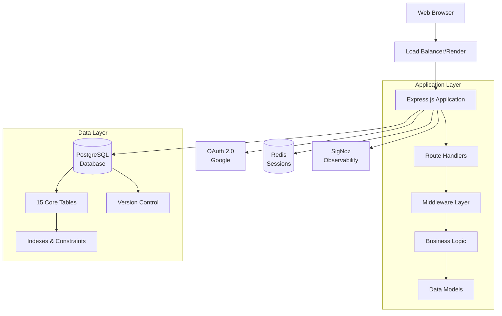

# System Architecture Overview

Comprehensive overview of the Conductor application architecture, design decisions, and system components.

## High-Level Architecture

Conductor is a **monolithic full-stack application** with a clear separation between frontend and backend layers, using PostgreSQL as the single source of truth.



## System Components

### 1. Frontend Layer

**Technology**: Vanilla JavaScript (ES6+), HTML5, CSS3

- **No framework** - Lightweight and fast
- **Server-side rendering** - HTML templates served by Express
- **Client-side interactivity** - Pure JavaScript modules
- **Responsive design** - CSS Grid and Flexbox
- **Theme support** - CSS custom properties for dynamic theming

**Key Components:**
- Role-based dashboards (6 variants)
- Attendance check-in interface
- Team management UI
- Journal entry forms
- Announcement system
- Real-time statistics widgets

### 2. Backend Layer

**Technology**: Node.js 18+, Express.js


**Layers:**

1. **Routes** (`src/routes/`) - 18 route modules
   - User management
   - Attendance tracking
   - Team operations
   - Enrollment management
   - Session management
   - Journal entries
   - Announcements

2. **Middleware** (`src/middleware/`)
   - Authentication (Passport.js)
   - Authorization (RBAC)
   - Error handling
   - Request logging
   - Metrics collection

3. **Services** (`src/services/`)
   - Permission checking
   - Enrollment logic
   - Attendance calculation
   - Team formation rules

4. **Models** (`src/models/`)
   - User model
   - Attendance model
   - Team model
   - Enrollment model

### 3. Database Layer

**Technology**: PostgreSQL 18

**Schema Design:**
- 15 core tables
- 13 ENUM types for type safety
- Comprehensive foreign keys with CASCADE
- Indexes on all frequently queried columns
- Triggers for automatic timestamp updates
- JSONB columns for flexible metadata

**Key Tables:**
- `users` - All system users
- `course_offerings` - Course information
- `enrollments` - User-course relationships
- `team` / `team_members` - Team structure
- `sessions` / `attendance` - Attendance tracking
- `permissions` / role mapping tables - RBAC system

### 4. Authentication & Authorization

**Authentication**: OAuth 2.0 via Google


**Authorization**: Role-Based Access Control (RBAC)

- **3-layer permission system**:
  1. Global permissions (based on user.primary_role)
  2. Course permissions (based on enrollments.course_role)
  3. Team permissions (based on team_members.role)

- **Permission format**: `{resource}.{action}` (e.g., `roster.import`)
- **Scopes**: `global`, `course`, `team`
- **Middleware**: `protect()`, `protectAny()`, `protectRole()`

### 5. Session Management

**Technology**: express-session

**Development**: In-memory session store
**Production**: Redis session store (recommended)

```javascript
// Session configuration
{
  secret: process.env.SESSION_SECRET,
  resave: false,
  saveUninitialized: false,
  cookie: {
    maxAge: 24 * 60 * 60 * 1000, // 24 hours
    httpOnly: true,
    secure: process.env.NODE_ENV === 'production',
    sameSite: 'lax'
  }
}
```

### 6. Observability

**Technology**: OpenTelemetry + SigNoz

**Metrics Collected:**
- HTTP request count and duration
- Database query count and latency
- User login events
- API error rates
- Active session count
- Journal entries created
- Attendance records

**Traces:**
- Full request lifecycle
- Database query traces
- External API calls (Google OAuth)

**Logs:**
- Authentication events (`auth_logs` table)
- User activity (`activity_logs` table)
- Application logs (console/file)

## Design Patterns

### 1. MVC-Like Architecture

```
Routes (Controller)
  ↓
Services (Business Logic)
  ↓
Models (Data Access)
  ↓
Database
```

### 2. Middleware Pipeline

```
Request
  → Authentication
  → Authorization (RBAC)
  → Validation
  → Business Logic
  → Response
```

### 3. Repository Pattern

```javascript
// Model handles data access
class UserModel {
  static async findById(id) {
    const result = await pool.query(
      'SELECT * FROM users WHERE id = $1',
      [id]
    );
    return result.rows[0];
  }
}

// Service handles business logic
class UserService {
  static async getUser(id, requestingUser) {
    // Check permissions
    if (!canViewUser(requestingUser, id)) {
      throw new ForbiddenError();
    }
    // Fetch data
    return await UserModel.findById(id);
  }
}
```

### 4. Error Handling

```javascript
// Centralized error handler
app.use((err, req, res, next) => {
  console.error(err.stack);
  
  if (err instanceof ValidationError) {
    return res.status(400).json({ error: err.message });
  }
  
  if (err instanceof UnauthorizedError) {
    return res.status(401).json({ error: 'Unauthorized' });
  }
  
  // Default 500
  res.status(500).json({ error: 'Internal server error' });
});
```

## Data Flow

### Example: Student Checks In to Session


## Security Architecture

### Defense in Depth

1. **Network Layer**
   - HTTPS only in production
   - CORS configuration
   - Rate limiting (future)

2. **Application Layer**
   - OAuth 2.0 authentication
   - Session management with HttpOnly cookies
   - CSRF protection (future)
   - Input validation

3. **Database Layer**
   - Parameterized queries (SQL injection prevention)
   - Foreign key constraints
   - Row-level security (future)

4. **Authorization Layer**
   - RBAC permission system
   - Resource-level access control
   - Audit logging

### Security Best Practices

- [OK] No sensitive data in environment variables (use secrets management in production)
- [OK] Password hashing (OAuth, no passwords stored)
- [OK] SQL injection prevention (parameterized queries)
- [OK] XSS prevention (HTML escaping)
- [OK] HTTPS in production
- [OK] Secure session cookies
- [OK] Audit logging for authentication

## Scalability Considerations

### Current Scale

- **Users**: 100-200 concurrent
- **Database**: Single PostgreSQL instance
- **Sessions**: In-memory (development) / Redis (production)
- **Deployment**: Single Render dyno

### Future Scalability

**Horizontal Scaling:**
- Load balancer with multiple Express instances
- Redis session store for session sharing
- Database connection pooling
- CDN for static assets

**Vertical Scaling:**
- Increase Render dyno size
- PostgreSQL read replicas
- Database query optimization
- Caching layer (Redis)

**Performance Targets:**
- [OK] <200ms average API response time
- [OK] Handle 150+ concurrent users
- [OK] 99.9% uptime in production
- [OK] <2s page load time

## Technology Stack Summary

### Backend
- **Runtime**: Node.js 18+
- **Framework**: Express.js 4.x
- **Database**: PostgreSQL 18
- **ORM**: Raw SQL with `pg` (node-postgres)
- **Authentication**: Passport.js with Google OAuth 2.0
- **Session**: express-session with Redis (production)
- **Validation**: Custom middleware + validator.js

### Frontend
- **HTML5** with semantic markup
- **CSS3** with custom properties
- **JavaScript** ES6+ (no build step)
- **No frameworks** - vanilla JS for speed

### DevOps
- **CI/CD**: GitHub Actions
- **Container**: Docker
- **Deployment**: Render (main), AWS ECS (infrastructure)
- **Observability**: OpenTelemetry + SigNoz
- **Monitoring**: SigNoz dashboards

### Testing
- **Unit**: Vitest
- **E2E**: Playwright
- **Load**: Autocannon
- **Coverage**: c8

### Quality
- **Linting**: ESLint, Stylelint, HTMLHint, Markdownlint
- **Documentation**: JSDoc
- **Git**: Conventional Commits

## Architecture Decision Records

See detailed ADRs in `docs/architecture/adrs/`:

- [ADR-001: CI/CD Pipeline](adrs/adr-001-cicd-pipeline-architecture.md)
- [ADR-002: Database Selection](adrs/adr-0002-database-selection.md)
- [ADR-003: Authentication](adrs/adr-0003-authentication-selection.md)
- [ADR-004: Server Framework](adrs/adr-0004-server-selection.md)

## Next Steps

-  [Database Schema](../database/schema.md) - Detailed database structure
-  [API Reference](../backend/api-reference.md) - All API endpoints
-  [RBAC System](../backend/rbac.md) - Permission system details
-  [Frontend Guide](../frontend/overview.md) - UI architecture
-  [Deployment](../deployment/ci-cd.md) - Production deployment

---

**See Also:**
- [Tech Stack Details](tech-stack.md) - In-depth technology analysis
- [Architecture Diagrams](diagrams.md) - Visual architecture references
