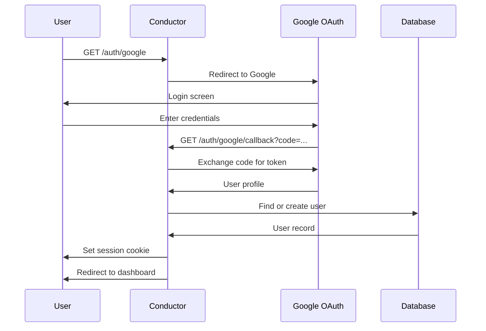

# Backend API Reference

Complete reference for all REST APIs in the Conductor application.

**Base URL**: `http://localhost:8443` (development)  
**Protocol**: HTTPS required in production  
**Authentication**: Session-based (Google OAuth 2.0)

## Table of Contents

1. [Authentication](#authentication)
2. [Users](#users)
3. [Enrollments](#enrollments)
4. [Teams](#teams)
5. [Offerings](#offerings)
6. [Attendance](#attendance)
7. [Journals](#journals)
8. [Interactions](#interactions)
9. [Announcements](#announcements)
10. [Diagnostics](#diagnostics)
11. [Error Handling](#error-handling)

---

## Authentication

### Google OAuth Flow



#### `GET /auth/google`

Initiates Google OAuth flow.

**Auth**: Not required  
**Response**: Redirects to Google login

#### `GET /auth/google/callback`

OAuth callback (handled automatically by Passport).

**Auth**: Not required  
**Response**: Redirects to appropriate dashboard based on role

#### `GET /logout`

Destroys session and logs out user.

**Auth**: Required  
**Response**: Redirects to `/login.html`

#### `GET /api/user`

Get currently authenticated user.

**Auth**: Required

**Response**:
```json
{
  "id": "uuid",
  "email": "user@ucsd.edu",
  "name": "Student Name",
  "primary_role": "student",
  "status": "active",
  "institution_type": "ucsd",
  "avatar_url": "https://...",
  "pronouns": "they/them",
  "major": "Computer Science",
  "academic_year": 2025,
  "linkedin_url": null,
  "github_username": "username",
  "personal_website": null,
  "bio": "Software engineer...",
  "created_at": "2025-09-23T10:00:00Z"
}
```

---

## Users

### `POST /api/users`

Create a new user.

**Auth**: Required  
**Permission**: `user.manage` (global)

**Request Body**:
```json
{
  "email": "newuser@ucsd.edu",
  "name": "New User",
  "primary_role": "student",
  "status": "active",
  "institution_type": "ucsd",
  "major": "Computer Science",
  "academic_year": 2026,
  "pronouns": "she/her"
}
```

**Response**: Created user object (201)

### `GET /api/users`

Get paginated list of all users.

**Auth**: Required  
**Permission**: `user.manage` (global)

**Query Parameters**:
- `limit` (number, default: 50): Users per page
- `offset` (number, default: 0): Skip N users
- `includeDeleted` (boolean, default: false): Include soft-deleted users

**Response**:
```json
{
  "users": [
    { "id": "uuid", "email": "...", "name": "..." }
  ],
  "total": 168,
  "limit": 50,
  "offset": 0
}
```

### `GET /api/users/:id`

Get specific user by ID.

**Auth**: Required  
**Permission**: `user.view` (global) OR viewing self

**Path Parameters**:
- `id` (UUID): User ID

**Response**: User object

### `PUT /api/users/:id`

Update user information.

**Auth**: Required  
**Permission**: Users can update themselves, OR `user.manage` (global) for others

**Path Parameters**:
- `id` (UUID): User ID

**Request Body** (partial update):
```json
{
  "name": "Updated Name",
  "pronouns": "they/them",
  "bio": "New bio text",
  "linkedin_url": "https://linkedin.com/in/username"
}
```

**Response**: Updated user object

### `DELETE /api/users/:id`

Soft delete a user (sets `deleted_at` timestamp).

**Auth**: Required  
**Permission**: `user.manage` (global)

**Path Parameters**:
- `id` (UUID): User ID

**Response**:
```json
{
  "message": "User soft deleted successfully",
  "id": "uuid"
}
```

### `POST /api/users/:id/restore`

Restore a soft-deleted user.

**Auth**: Required  
**Permission**: `user.manage` (global)

**Path Parameters**:
- `id` (UUID): User ID

**Response**:
```json
{
  "message": "User restored successfully",
  "id": "uuid"
}
```

### `GET /api/users/role/:role`

Get users by primary role.

**Auth**: Required  
**Permission**: `user.manage` (global)

**Path Parameters**:
- `role` (string): One of `admin`, `instructor`, `professor`, `student`, `unregistered`

**Query Parameters**:
- `limit` (number): Users per page
- `offset` (number): Skip N users

**Response**: Array of user objects

### `GET /api/users/institution/:type`

Get users by institution type.

**Auth**: Required  
**Permission**: `user.view` (global)

**Path Parameters**:
- `type` (string): `ucsd` or `extension`

**Response**: Array of user objects

---

## Roster Management

### `POST /api/users/roster/import/json`

Bulk import users from JSON array.

**Auth**: Required  
**Permission**: `roster.import` (course scope)

**Request Body**:
```json
{
  "offering_id": "uuid",
  "users": [
    {
      "email": "student1@ucsd.edu",
      "name": "Student One",
      "primary_role": "student",
      "status": "active",
      "major": "Computer Science",
      "academic_year": 2026
    }
  ]
}
```

**Response**:
```json
{
  "message": "Import completed: 10 succeeded, 2 failed",
  "imported": 10,
  "failed": 2,
  "errors": [
    { "email": "bad@email", "reason": "Invalid email format" }
  ],
  "imported_users": ["uuid1", "uuid2"]
}
```

### `POST /api/users/roster/import/csv`

Bulk import from CSV file upload.

**Auth**: Required  
**Permission**: `roster.import` (course scope)  
**Content-Type**: `multipart/form-data`

**Form Data**:
- `file`: CSV file
- `offering_id`: UUID (optional in form, can be in query)

**CSV Format**:
```csv
email,name,primary_role,status,major,academic_year
student1@ucsd.edu,Student One,student,active,Computer Science,2026
student2@ucsd.edu,Student Two,student,active,Data Science,2025
```

**Response**: Same as JSON import

### `GET /api/users/roster/export/json`

Export all users as JSON file.

**Auth**: Required  
**Permission**: `roster.export` OR `course.manage` (course scope)

**Response**: JSON file download

### `GET /api/users/roster/export/csv`

Export all users as CSV file.

**Auth**: Required  
**Permission**: `roster.export` OR `course.manage` (course scope)

**Response**: CSV file download

### `POST /api/users/roster/export/imported/csv`

Export specific imported users as CSV.

**Auth**: Required

**Request Body**:
```json
{
  "importedUsers": ["uuid1", "uuid2", "uuid3"]
}
```

**Response**: CSV file download with only specified users

### `POST /api/users/roster/rollback`

Rollback last import (delete imported users).

**Auth**: Required  
**Permission**: `roster.import` (course scope)

**Request Body**:
```json
{
  "userIds": ["uuid1", "uuid2", "uuid3"]
}
```

**Response**:
```json
{
  "message": "Rollback completed: 10 users removed, 0 failed",
  "rolled_back_count": 10,
  "failed_count": 0,
  "rolled_back": ["uuid1", "uuid2"],
  "failed": []
}
```

---

## Enrollments

### `POST /api/enrollments`

Create new enrollment.

**Auth**: Required  
**Permission**: `enrollment.manage` (course scope)

**Request Body**:
```json
{
  "offering_id": "uuid",
  "user_id": "uuid",
  "course_role": "student",
  "status": "enrolled"
}
```

**Valid `course_role` values**: `student`, `ta`, `tutor`, `student-leader`, `instructor`, `professor`  
**Valid `status` values**: `enrolled`, `waitlisted`, `dropped`, `completed`

**Response**: Created enrollment object (201)

### `GET /api/enrollments/:id`

Get enrollment by ID.

**Auth**: Required  
**Permission**: `roster.view` OR viewing own enrollment

**Response**: Enrollment object

### `GET /api/enrollments/offering/:offeringId`

Get all enrollments for an offering.

**Auth**: Required  
**Permission**: `roster.view` (course scope)

**Path Parameters**:
- `offeringId` (UUID): Offering ID

**Query Parameters**:
- `limit` (number, default: 50)
- `offset` (number, default: 0)
- `course_role` (string, optional): Filter by role
- `status` (string, optional): Filter by status

**Response**: Array of enrollment objects with user details

### `GET /api/enrollments/user/:userId`

Get all enrollments for a user.

**Auth**: Required  
**Permission**: Viewing own OR `roster.view` (global)

**Response**: Array of enrollment objects with offering details

### `GET /api/enrollments/offering/:offeringId/staff`

Get all course staff (TAs + tutors).

**Auth**: Required  
**Permission**: `roster.view` (course scope)

**Response**: Array of staff enrollments

### `GET /api/enrollments/offering/:offeringId/tas`

Get all TAs for an offering.

**Auth**: Required  
**Permission**: `roster.view` (course scope)

**Response**: Array of TA enrollments

### `GET /api/enrollments/offering/:offeringId/tutors`

Get all tutors for an offering.

**Auth**: Required  
**Permission**: `roster.view` (course scope)

**Response**: Array of tutor enrollments

### `GET /api/enrollments/offering/:offeringId/students`

Get all students for an offering.

**Auth**: Required  
**Permission**: `roster.view` (course scope)

**Response**: Array of student enrollments

### `PUT /api/enrollments/offering/:offeringId/user/:userId/role`

Change enrollment role (promote/demote).

**Auth**: Required  
**Permission**: `enrollment.manage` (course scope)

**Request Body**:
```json
{
  "course_role": "ta"
}
```

**Examples**:
- Promote student to TA: `{ "course_role": "ta" }`
- Promote student to tutor: `{ "course_role": "tutor" }`
- Demote TA to student: `{ "course_role": "student" }`

**Response**: Updated enrollment object

### `PUT /api/enrollments/:id`

Update enrollment status or other fields.

**Auth**: Required  
**Permission**: `enrollment.manage` (course scope) OR updating own

**Request Body**:
```json
{
  "status": "dropped",
  "dropped_at": "2025-10-15T00:00:00Z"
}
```

**Response**: Updated enrollment object

### `POST /api/enrollments/offering/:offeringId/user/:userId/drop`

Drop an enrollment (set status to 'dropped').

**Auth**: Required  
**Permission**: Can drop self OR `enrollment.manage` (course scope)

**Response**:
```json
{
  "message": "Enrollment dropped successfully",
  "enrollment": { /* updated enrollment */ }
}
```

### `DELETE /api/enrollments/:id`

Hard delete an enrollment.

**Auth**: Required  
**Permission**: `enrollment.manage` (course scope)

**Response**: 204 No Content

### `GET /api/enrollments/offering/:offeringId/stats`

Get enrollment statistics.

**Auth**: Required  
**Permission**: `roster.view` (course scope)

**Response**:
```json
{
  "enrollments": [
    { "course_role": "student", "status": "enrolled", "count": 78 },
    { "course_role": "ta", "status": "enrolled", "count": 5 },
    { "course_role": "tutor", "status": "enrolled", "count": 3 }
  ],
  "total": 86
}
```

---

## Teams

### `GET /api/teams`

Get all teams for an offering.

**Auth**: Required  
**Permission**: `roster.view` (course scope)

**Query Parameters**:
- `offering_id` (UUID, required): Offering ID

**Response**:
```json
{
  "teams": [
    {
      "id": "uuid",
      "name": "Team 1",
      "team_number": 1,
      "status": "active",
      "member_count": 8,
      "leader": { "id": "uuid", "name": "Leader Name" }
    }
  ]
}
```

### `GET /api/teams/my-team`

Get authenticated user's team for active offering.

**Auth**: Required

**Response**: Team object with members array

### `GET /api/teams/:teamId`

Get team details with members.

**Auth**: Required  
**Permission**: `roster.view` (course scope)

**Response**:
```json
{
  "id": "uuid",
  "name": "Team 1",
  "team_number": 1,
  "status": "active",
  "logo_url": "https://...",
  "team_mantra": "Build fast, test faster",
  "github_link": "https://github.com/org/repo",
  "youtube_link": null,
  "members": [
    {
      "user_id": "uuid",
      "name": "Member Name",
      "role": "leader",
      "email": "member@ucsd.edu"
    }
  ]
}
```

### `POST /api/teams`

Create new team.

**Auth**: Required  
**Permission**: `course.manage` (course scope)

**Request Body**:
```json
{
  "offering_id": "uuid",
  "name": "Team 11",
  "team_number": 11,
  "leader_id": "uuid",
  "status": "forming"
}
```

**Valid `status` values**: `forming`, `active`, `inactive`, `archived`

**Response**: Created team object (201)

### `PUT /api/teams/:teamId`

Update team details.

**Auth**: Required  
**Permission**: `course.manage` (course scope) OR team leader

**Request Body** (partial update):
```json
{
  "name": "Updated Team Name",
  "status": "active",
  "logo_url": "https://...",
  "team_mantra": "New mantra",
  "github_link": "https://github.com/..."
}
```

**Response**: Updated team object

### `DELETE /api/teams/:teamId`

Delete team.

**Auth**: Required  
**Permission**: `course.manage` (course scope)

**Response**: 204 No Content

### `GET /api/teams/:teamId/members`

Get all team members.

**Auth**: Required  
**Permission**: `roster.view` (course scope)

**Response**: Array of team member objects with user details

### `POST /api/teams/:teamId/members`

Add member to team.

**Auth**: Required  
**Permission**: `course.manage` (course scope)

**Request Body**:
```json
{
  "user_id": "uuid",
  "role": "member"
}
```

**Valid `role` values**: `leader`, `member`

**Response**: Created team member object (201)

### `DELETE /api/teams/:teamId/members/:userId`

Remove member from team.

**Auth**: Required  
**Permission**: `course.manage` (course scope)

**Response**: 204 No Content

---

## Offerings

### `GET /api/offerings/:offeringId`

Get offering details with statistics.

**Auth**: Required  
**Permission**: `roster.view` (course scope)

**Response**:
```json
{
  "id": "uuid",
  "course_code": "CSE210",
  "course_name": "Software Engineering",
  "term": "Fall",
  "year": 2025,
  "status": "active",
  "start_date": "2025-09-23",
  "end_date": "2025-12-15",
  "student_count": 78,
  "ta_count": 5,
  "tutor_count": 3,
  "team_count": 10
}
```

### `GET /api/offerings/:offeringId/stats`

Get detailed offering statistics.

**Auth**: Required  
**Permission**: `course.manage` (course scope)

**Response**:
```json
{
  "enrollments": [
    { "course_role": "student", "status": "enrolled", "count": 78 }
  ],
  "teams": [
    { "status": "active", "count": 10 }
  ],
  "total_team_members": 75,
  "attendance_rate": 0.87
}
```

---

## Attendance

### `POST /api/attendance/sessions`

Create attendance session.

**Auth**: Required  
**Permission**: `attendance.manage` (course scope)

**Request Body**:
```json
{
  "offering_id": "uuid",
  "team_id": "uuid",
  "session_type": "lecture",
  "session_date": "2025-11-15",
  "access_code": "FALL2025",
  "expires_at": "2025-11-15T15:00:00Z"
}
```

**Valid `session_type` values**: `lecture`, `lab`, `discussion`, `office_hours`, `team_meeting`

**Response**: Created session object (201)

### `GET /api/attendance/sessions/:sessionId`

Get session details with attendance records.

**Auth**: Required  
**Permission**: `attendance.view` (course scope)

**Response**:
```json
{
  "id": "uuid",
  "session_type": "lecture",
  "session_date": "2025-11-15",
  "access_code": "FALL2025",
  "attendance_count": 75,
  "records": [
    {
      "user_id": "uuid",
      "name": "Student Name",
      "checked_in_at": "2025-11-15T14:05:00Z"
    }
  ]
}
```

### `POST /api/attendance/checkin`

Check in to attendance session.

**Auth**: Required

**Request Body**:
```json
{
  "access_code": "FALL2025"
}
```

**Response**:
```json
{
  "message": "Checked in successfully",
  "record": {
    "id": "uuid",
    "session_id": "uuid",
    "checked_in_at": "2025-11-15T14:05:23Z"
  }
}
```

### `GET /api/attendance/my-attendance`

Get authenticated user's attendance records.

**Auth**: Required

**Query Parameters**:
- `offering_id` (UUID, optional): Filter by offering
- `start_date` (date, optional): Filter from date
- `end_date` (date, optional): Filter to date

**Response**: Array of attendance records

---

## Journals

### Student Journals

#### `POST /api/journals`

Submit journal entry.

**Auth**: Required

**Request Body**:
```json
{
  "offering_id": "uuid",
  "entry_date": "2025-11-15",
  "entry_text": "Today we worked on implementing the authentication system...",
  "hours_worked": 4.5
}
```

**Response**: Created journal entry (201)

#### `GET /api/journals`

Get user's journal entries.

**Auth**: Required

**Query Parameters**:
- `offering_id` (UUID, optional)
- `start_date` (date, optional)
- `end_date` (date, optional)

**Response**: Array of journal entries

#### `PUT /api/journals/:id`

Update journal entry.

**Auth**: Required (must be entry owner)

**Request Body** (partial update):
```json
{
  "entry_text": "Updated content...",
  "hours_worked": 5.0
}
```

**Response**: Updated entry

#### `DELETE /api/journals/:id`

Delete journal entry.

**Auth**: Required (must be entry owner)

**Response**: 204 No Content

### TA/Tutor Journals

Same endpoints as student journals but at:
- `/api/ta-journals`
- `/api/tutor-journals`

### Instructor Journals

#### `POST /api/instructor-journals`

Submit instructor journal.

**Auth**: Required  
**Permission**: `course.manage` (course scope)

**Request Body**:
```json
{
  "offering_id": "uuid",
  "entry_date": "2025-11-15",
  "entry_text": "Observed great progress on Sprint 2...",
  "team_id": "uuid"
}
```

---

## Interactions

### `POST /api/interactions`

Submit interaction report (positive/negative).

**Auth**: Required  
**Permission**: `course.manage` (course scope)

**Request Body**:
```json
{
  "offering_id": "uuid",
  "team_id": "uuid",
  "user_id": "uuid",
  "interaction_type": "positive",
  "notes": "Great progress on Sprint 2 deliverables."
}
```

**Valid `interaction_type` values**: `positive`, `negative`  
**Note**: Either `team_id` or `user_id` required (or both)

**Response**: Created interaction (201)

### `GET /api/interactions`

Get all interactions for an offering.

**Auth**: Required  
**Permission**: `course.manage` (course scope)

**Query Parameters**:
- `offering_id` (UUID, required)
- `team_id` (UUID, optional): Filter by team
- `user_id` (UUID, optional): Filter by student

**Response**: Array of interaction objects

### `GET /api/interactions/team/:teamId`

Get team interactions.

**Auth**: Required  
**Permission**: `course.manage` (course scope)

**Response**: Array of interactions for team

### `GET /api/interactions/student/:userId`

Get student interactions.

**Auth**: Required  
**Permission**: `course.manage` (course scope)

**Response**: Array of interactions for student

---

## Announcements

### `POST /api/announcements`

Create announcement.

**Auth**: Required  
**Permission**: `announcement.create` (course scope)

**Request Body**:
```json
{
  "offering_id": "uuid",
  "title": "Sprint 2 Deadline Extended",
  "content": "The Sprint 2 deadline has been extended to Nov 20...",
  "priority": "high",
  "expires_at": "2025-11-20T23:59:59Z"
}
```

**Valid `priority` values**: `low`, `normal`, `high`, `urgent`

**Response**: Created announcement (201)

### `GET /api/announcements`

Get announcements for offering.

**Auth**: Required

**Query Parameters**:
- `offering_id` (UUID, required)
- `limit` (number, default: 50)
- `include_expired` (boolean, default: false)

**Response**: Array of announcements

### `PUT /api/announcements/:id`

Update announcement.

**Auth**: Required  
**Permission**: `announcement.manage` (course scope)

**Response**: Updated announcement

### `DELETE /api/announcements/:id`

Delete announcement.

**Auth**: Required  
**Permission**: `announcement.manage` (course scope)

**Response**: 204 No Content

### Team Announcements

Similar endpoints at `/api/team-announcements` with `team_id` instead of `offering_id`.

---

## Diagnostics

### `GET /api/diagnostics/history`

Get diagnostics submission history.

**Auth**: Required

**Query Parameters**:
- `offering_id` (UUID, optional)

**Response**: Array of diagnostic submissions

### `POST /api/diagnostics`

Submit diagnostic.

**Auth**: Required

**Request Body**:
```json
{
  "offering_id": "uuid",
  "diagnostic_type": "weekly_check",
  "responses": {
    "q1": "answer1",
    "q2": "answer2"
  }
}
```

**Response**: Created diagnostic (201)

---

## Error Handling

### Error Response Format

All errors follow this structure:

```json
{
  "error": "Detailed error message",
  "code": "ERROR_CODE",
  "details": { /* additional context */ }
}
```

### HTTP Status Codes

| Code | Meaning | Example |
|------|---------|---------|
| 200 | Success | GET request successful |
| 201 | Created | Resource created successfully |
| 204 | No Content | DELETE successful |
| 400 | Bad Request | Invalid request body |
| 401 | Unauthorized | Not authenticated |
| 403 | Forbidden | Insufficient permissions |
| 404 | Not Found | Resource doesn't exist |
| 409 | Conflict | Duplicate entry |
| 429 | Too Many Requests | Rate limit exceeded |
| 500 | Internal Server Error | Server error |

### Common Error Codes

- `AUTH_REQUIRED` - Authentication required
- `PERMISSION_DENIED` - Insufficient permissions
- `VALIDATION_ERROR` - Request validation failed
- `NOT_FOUND` - Resource not found
- `DUPLICATE_ENTRY` - Unique constraint violation
- `RATE_LIMIT_EXCEEDED` - Too many requests

---

## Rate Limiting

Certain endpoints have rate limits:

| Endpoint | Limit | Window |
|----------|-------|--------|
| `/api/users/roster/import/*` | 5 requests | 15 minutes |
| `/api/attendance/checkin` | 10 requests | 1 minute |
| `/auth/google` | 10 requests | 1 minute |

**Rate Limit Headers**:
```
X-RateLimit-Limit: 5
X-RateLimit-Remaining: 3
X-RateLimit-Reset: 1635789600
```

---

## Pagination

All list endpoints support pagination:

**Query Parameters**:
- `limit` (number, default: 50, max: 100)
- `offset` (number, default: 0)

**Response Format**:
```json
{
  "data": [ /* array of items */ ],
  "pagination": {
    "total": 168,
    "limit": 50,
    "offset": 0,
    "has_more": true
  }
}
```

---

## API Summary

**Total Endpoints**: 61  
**Categories**: 10  
**Authentication**: Session-based (Google OAuth)  
**Authorization**: Permission-based RBAC

**See Also:**
- [RBAC Documentation](rbac.md)
- [Authentication Guide](authentication.md)
- [Database Schema](../database/schema.md)
