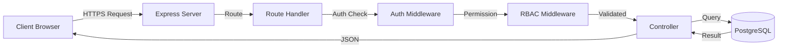

# Backend Overview

High-level overview of the Conductor backend architecture and implementation.

## Architecture

### Request-Response Flow



### Layer Architecture

```
┌─────────────────────────────────────┐
│         Client (Browser)            │
└──────────────┬──────────────────────┘
               │ HTTP/HTTPS
┌──────────────▼──────────────────────┐
│      Routes (src/routes/)           │  ← URL endpoints
├─────────────────────────────────────┤
│    Middleware (src/middleware/)     │  ← Auth, RBAC, validation
├─────────────────────────────────────┤
│   Controllers (in route files)      │  ← Business logic
├─────────────────────────────────────┤
│   Database (PostgreSQL pool)        │  ← Data persistence
└─────────────────────────────────────┘
```

## Technology Stack

| Layer | Technology | Purpose |
|-------|------------|---------|
| Runtime | Node.js 18 LTS | JavaScript execution environment |
| Framework | Express.js 4.21.2 | Web server framework |
| Database | PostgreSQL 18 | Relational database |
| DB Client | node-postgres (pg) | PostgreSQL client |
| Authentication | Passport.js | OAuth 2.0 authentication |
| Session | express-session | Session management |
| File Upload | Multer | Multipart form data handling |
| Validation | Validator.js | Input validation |
| Observability | OpenTelemetry | Metrics, traces, logs |

## Project Structure

```
src/
├── server.js              # Application entry point
├── routes/                # API route definitions
│   ├── user-routes.js     # User & roster management
│   ├── enrollment-routes.js # Enrollment operations
│   ├── team-routes.js     # Team management
│   ├── attendance-routes.js # Attendance tracking
│   ├── journal-routes.js  # Student journals
│   ├── ta-journal-routes.js # TA journals
│   ├── tutor-journal-routes.js # Tutor journals
│   ├── instructor-journal-routes.js # Instructor journals
│   ├── interaction-routes.js # Interaction reports
│   ├── announcement-routes.js # Announcements
│   ├── team-announcement-routes.js # Team announcements
│   ├── diagnostic-routes.js # Diagnostic submissions
│   ├── offering-routes.js # Course offerings
│   ├── dashboard-routes.js # Dashboard data
│   ├── todo-routes.js     # TODO items
│   └── auth-routes.js     # Authentication
├── middleware/            # Express middleware
│   ├── rbac.js           # Permission-based access control
│   ├── rate-limit.js     # Rate limiting
│   └── error-handler.js  # Error handling
├── db/                   # Database utilities
│   └── pool.js          # Connection pool setup
└── utils/               # Utility functions
    ├── validators.js    # Input validation
    └── logger.js        # Logging utilities
```

## Core Concepts

### 1. Routes

Routes define API endpoints and their handlers.

**Example** (`src/routes/user-routes.js`):
```javascript
import express from 'express';
import { pool } from '../db/pool.js';
import { protect } from '../middleware/rbac.js';

const router = express.Router();

router.get('/', ...protect('user.view', 'global'), async (req, res) => {
  try {
    const result = await pool.query('SELECT * FROM users');
    res.json(result.rows);
  } catch (err) {
    res.status(500).json({ error: err.message });
  }
});

export default router;
```

**Route Organization**:
- One file per resource type (users, teams, enrollments)
- RESTful conventions (GET, POST, PUT, DELETE)
- Middleware chaining for auth and permissions

### 2. Middleware

Middleware functions execute before route handlers.

**Authentication Middleware**:
```javascript
function ensureAuthenticated(req, res, next) {
  if (req.isAuthenticated()) {
    return next();
  }
  res.status(401).json({ error: 'Authentication required' });
}
```

**RBAC Middleware**:
```javascript
function protect(permission, scope) {
  return [
    ensureAuthenticated,
    async (req, res, next) => {
      const hasPermission = await checkPermission(
        req.user.id,
        permission,
        scope,
        req.params.offeringId || req.query.offering_id
      );
      if (!hasPermission) {
        return res.status(403).json({ error: 'Permission denied' });
      }
      next();
    }
  ];
}
```

**Usage**:
```javascript
router.post('/', ...protect('user.manage', 'global'), handler);
router.get('/:id', ...protect('roster.view', 'course'), handler);
```

### 3. Database Access

Direct SQL queries using parameterized statements.

**Simple Query**:
```javascript
const result = await pool.query(
  'SELECT * FROM users WHERE id = $1',
  [userId]
);
const user = result.rows[0];
```

**Transactions**:
```javascript
const client = await pool.connect();
try {
  await client.query('BEGIN');
  
  const userResult = await client.query(
    'INSERT INTO users (...) VALUES (...) RETURNING *',
    [values]
  );
  
  await client.query(
    'INSERT INTO enrollments (...) VALUES (...)',
    [values]
  );
  
  await client.query('COMMIT');
  return userResult.rows[0];
} catch (err) {
  await client.query('ROLLBACK');
  throw err;
} finally {
  client.release();
}
```

### 4. Error Handling

Centralized error handling with try-catch blocks.

```javascript
router.get('/:id', async (req, res) => {
  try {
    const result = await pool.query(...);
    
    if (result.rows.length === 0) {
      return res.status(404).json({ error: 'User not found' });
    }
    
    res.json(result.rows[0]);
  } catch (err) {
    console.error('Error fetching user:', err);
    res.status(500).json({ 
      error: 'Internal server error',
      details: process.env.NODE_ENV === 'development' ? err.message : undefined
    });
  }
});
```

### 5. Input Validation

Validate all user inputs before processing.

```javascript
import validator from 'validator';

router.post('/', async (req, res) => {
  const { email, name } = req.body;
  
  // Validate email
  if (!email || !validator.isEmail(email)) {
    return res.status(400).json({ error: 'Invalid email address' });
  }
  
  // Validate name
  if (!name || name.trim().length === 0) {
    return res.status(400).json({ error: 'Name is required' });
  }
  
  if (name.length > 100) {
    return res.status(400).json({ error: 'Name too long' });
  }
  
  // Proceed with creation
  // ...
});
```

## Key Features

### 1. Session Management

**Configuration** (`src/server.js`):
```javascript
import session from 'express-session';

app.use(session({
  secret: process.env.SESSION_SECRET,
  resave: false,
  saveUninitialized: false,
  cookie: {
    maxAge: 24 * 60 * 60 * 1000, // 24 hours
    httpOnly: true,
    secure: process.env.NODE_ENV === 'production',
    sameSite: 'lax'
  }
}));
```

**Session Storage**:
- Development: MemoryStore (in-memory)
- Production: Should use Redis or database-backed store

### 2. CORS Configuration

```javascript
import cors from 'cors';

const corsOptions = {
  origin: process.env.FRONTEND_URL || 'http://localhost:8443',
  credentials: true,
  optionsSuccessStatus: 200
};

app.use(cors(corsOptions));
```

### 3. File Uploads

Using Multer for CSV/JSON roster imports:

```javascript
import multer from 'multer';

const storage = multer.diskStorage({
  destination: './uploads/',
  filename: (req, file, cb) => {
    const uniqueSuffix = Date.now() + '-' + Math.round(Math.random() * 1E9);
    cb(null, file.fieldname + '-' + uniqueSuffix + '.csv');
  }
});

const upload = multer({ 
  storage,
  limits: { fileSize: 5 * 1024 * 1024 }, // 5MB limit
  fileFilter: (req, file, cb) => {
    if (file.mimetype === 'text/csv' || file.mimetype === 'application/csv') {
      cb(null, true);
    } else {
      cb(new Error('Only CSV files allowed'));
    }
  }
});

router.post('/import', upload.single('file'), async (req, res) => {
  // Process req.file
});
```

### 4. Rate Limiting

Protect endpoints from abuse:

```javascript
import rateLimit from 'express-rate-limit';

const rosterImportLimiter = rateLimit({
  windowMs: 15 * 60 * 1000, // 15 minutes
  max: 5, // 5 requests per window
  message: 'Too many import attempts, please try again later',
  standardHeaders: true,
  legacyHeaders: false
});

router.post('/roster/import', rosterImportLimiter, handler);
```

### 5. OpenTelemetry Instrumentation

```javascript
import { NodeSDK } from '@opentelemetry/sdk-node';
import { HttpInstrumentation } from '@opentelemetry/instrumentation-http';
import { ExpressInstrumentation } from '@opentelemetry/instrumentation-express';

const sdk = new NodeSDK({
  serviceName: 'conductor-api',
  instrumentations: [
    new HttpInstrumentation(),
    new ExpressInstrumentation(),
    new PgInstrumentation()
  ]
});

sdk.start();
```

## Performance Optimizations

### 1. Database Connection Pooling

```javascript
import pkg from 'pg';
const { Pool } = pkg;

export const pool = new Pool({
  max: 20,                      // Max 20 connections
  idleTimeoutMillis: 30000,     // 30s idle timeout
  connectionTimeoutMillis: 2000 // 2s connect timeout
});
```

### 2. SQL Query Optimization

- Use indexes on frequently queried columns
- Limit result sets with pagination
- Use `SELECT` with specific columns (not `SELECT *`)
- Cache frequently accessed data

**Example**:
```javascript
// Bad: No pagination, SELECT *
const result = await pool.query('SELECT * FROM users');

// Good: Pagination, specific columns
const result = await pool.query(
  'SELECT id, email, name, primary_role FROM users LIMIT $1 OFFSET $2',
  [limit, offset]
);
```

### 3. Caching Strategies

```javascript
// In-memory cache for frequently accessed data
const offeringCache = new Map();

async function getOffering(id) {
  if (offeringCache.has(id)) {
    return offeringCache.get(id);
  }
  
  const result = await pool.query('SELECT * FROM course_offerings WHERE id = $1', [id]);
  const offering = result.rows[0];
  
  offeringCache.set(id, offering);
  setTimeout(() => offeringCache.delete(id), 60000); // Cache for 1 minute
  
  return offering;
}
```

## Security Best Practices

### 1. SQL Injection Prevention

[OK] **Always use parameterized queries**:
```javascript
// GOOD
const result = await pool.query(
  'SELECT * FROM users WHERE email = $1',
  [email]
);

// BAD - Never do this!
const result = await pool.query(
  `SELECT * FROM users WHERE email = '${email}'`
);
```

### 2. XSS Prevention

- Set `httpOnly` on cookies
- Sanitize user inputs before storing
- Use Content Security Policy headers

### 3. CSRF Protection

- Use SameSite cookies
- Verify origin headers
- Implement CSRF tokens (future)

### 4. Password Handling

- **Never store plaintext passwords**
- Use bcrypt for hashing (if adding password auth)
- Enforce strong password policies

### 5. Environment Variables

Store secrets in `.env` (never commit):
```bash
SESSION_SECRET=random-32-char-string
GOOGLE_CLIENT_ID=...
GOOGLE_CLIENT_SECRET=...
DATABASE_URL=postgresql://...
```

## Testing

### Unit Tests (Vitest)

```javascript
import { describe, it, expect, vi } from 'vitest';
import { validateEmail } from './validators.js';

describe('validateEmail', () => {
  it('should accept valid emails', () => {
    expect(validateEmail('user@ucsd.edu')).toBe(true);
  });
  
  it('should reject invalid emails', () => {
    expect(validateEmail('invalid')).toBe(false);
  });
});
```

### API Tests (Playwright)

See [Testing Documentation](../testing/overview.md)

## Common Patterns

### RESTful API Design

| Method | Path | Action |
|--------|------|--------|
| GET | `/api/users` | List all users |
| GET | `/api/users/:id` | Get specific user |
| POST | `/api/users` | Create new user |
| PUT | `/api/users/:id` | Update user |
| DELETE | `/api/users/:id` | Delete user |

### Bulk Operations

```javascript
router.post('/bulk', async (req, res) => {
  const { users } = req.body;
  const client = await pool.connect();
  
  try {
    await client.query('BEGIN');
    
    const results = [];
    for (const user of users) {
      const result = await client.query(
        'INSERT INTO users (...) VALUES (...) RETURNING *',
        [user.email, user.name]
      );
      results.push(result.rows[0]);
    }
    
    await client.query('COMMIT');
    res.status(201).json({ created: results });
  } catch (err) {
    await client.query('ROLLBACK');
    res.status(500).json({ error: err.message });
  } finally {
    client.release();
  }
});
```

### Soft Deletes

```javascript
router.delete('/:id', async (req, res) => {
  // Soft delete (set deleted_at)
  await pool.query(
    'UPDATE users SET deleted_at = NOW() WHERE id = $1',
    [req.params.id]
  );
  
  res.status(204).send();
});

router.post('/:id/restore', async (req, res) => {
  // Restore soft deleted
  await pool.query(
    'UPDATE users SET deleted_at = NULL WHERE id = $1',
    [req.params.id]
  );
  
  res.json({ message: 'User restored' });
});
```

## Deployment

### Environment Configuration

```javascript
const config = {
  port: process.env.PORT || 8443,
  database: {
    connectionString: process.env.DATABASE_URL,
    ssl: process.env.NODE_ENV === 'production' ? { rejectUnauthorized: false } : false
  },
  session: {
    secret: process.env.SESSION_SECRET,
    secure: process.env.NODE_ENV === 'production'
  }
};
```

### Health Check

```javascript
router.get('/health', async (req, res) => {
  try {
    // Check database connection
    await pool.query('SELECT 1');
    
    res.json({
      ok: true,
      timestamp: new Date().toISOString(),
      uptime: process.uptime(),
      environment: process.env.NODE_ENV
    });
  } catch (err) {
    res.status(503).json({
      ok: false,
      error: 'Database connection failed'
    });
  }
});
```

---

**See Also:**
- [API Reference](api-reference.md)
- [RBAC System](rbac.md)
- [Authentication](authentication.md)
- [Database Schema](../database/schema.md)
