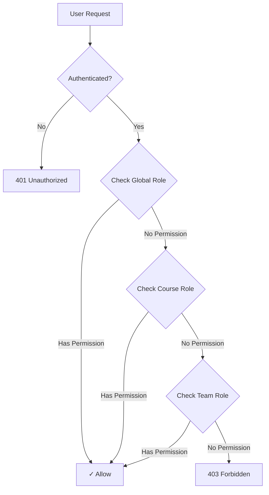
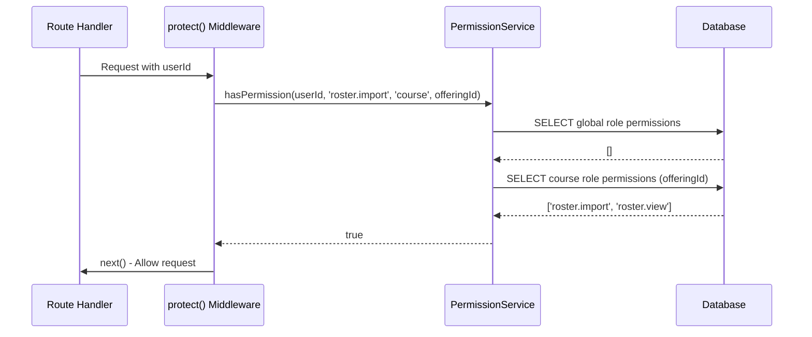

# Role-Based Access Control (RBAC) System

Comprehensive guide to Conductor's permission-based RBAC system.

## Overview

Conductor uses a **3-layer permission-based RBAC system** instead of simple role checks:

1. **Global Permissions** - Based on `users.primary_role`
2. **Course Permissions** - Based on `enrollments.course_role`
3. **Team Permissions** - Based on `team_members.role`



### Key Principles

- **Least Privilege**: Users only get permissions they need
- **Scope-Based**: Permissions apply at global, course, or team level
- **Database-Driven**: Policies defined in SQL seeds, not hardcoded
- **Hierarchical**: Admin automatically has all permissions
- **Composable**: Course/team permissions can override global permissions

## Permission Structure

### Permission Anatomy

Each permission has:
- **Scope**: `global`, `course`, or `team`
- **Resource**: What it applies to (e.g., `user`, `roster`, `enrollment`)
- **Action**: What can be done (e.g., `view`, `manage`, `import`)
- **Code**: Unique identifier (e.g., `user.manage`, `roster.view`)

**Example**:
```sql
INSERT INTO permissions (scope, resource, action, code, description)
VALUES (
  'course',
  'roster',
  'import',
  'roster.import',
  'Import roster data for a course offering'
);
```

### Available Permissions

#### Global Scope

| Code | Resource | Action | Description |
|------|----------|--------|-------------|
| `user.view` | user | view | View user information |
| `user.manage` | user | manage | Create, update, delete users |
| `roster.export` | roster | export | Export roster as JSON/CSV |

#### Course Scope

| Code | Resource | Action | Description |
|------|----------|--------|-------------|
| `roster.view` | roster | view | View roster and enrollment lists |
| `roster.import` | roster | import | Import roster from JSON/CSV |
| `enrollment.manage` | enrollment | manage | Create/update/delete enrollments |
| `course.manage` | course | manage | Course-level admin & stats |
| `attendance.view` | attendance | view | View attendance records |
| `attendance.manage` | attendance | manage | Create attendance sessions, manage records |
| `announcement.view` | announcement | view | View course announcements |
| `announcement.create` | announcement | create | Create announcements |
| `announcement.manage` | announcement | manage | Update/delete announcements |

#### Team Scope

| Code | Resource | Action | Description |
|------|----------|--------|-------------|
| `team.view` | team | view | View team information |
| `team.manage` | team | manage | Update team details |
| `team.member.manage` | team.member | manage | Add/remove team members |

## Roles and Mappings

### Global Roles

Stored in `users.primary_role`:

| Role | Global Permissions |
|------|-------------------|
| **Admin** | All permissions (automatic) |
| **Instructor** | `user.view`, `user.manage`, `roster.export` |
| **Professor** | `user.view`, `roster.export` |
| **Student** | `roster.view` |
| **Unregistered** | `roster.view` |

**Database Mapping** (`user_role_permissions`):
```sql
INSERT INTO user_role_permissions (user_role, permission_id)
SELECT 'instructor', p.id
FROM permissions p
WHERE p.code IN ('user.view', 'user.manage', 'roster.export');
```

### Course Roles

Stored in `enrollments.course_role`:

| Role | Course Permissions |
|------|-------------------|
| **Instructor** | `roster.*`, `enrollment.*`, `course.*`, `attendance.*`, `announcement.*` |
| **Professor** | `roster.*`, `enrollment.*`, `course.*`, `attendance.*`, `announcement.*` |
| **TA** | `roster.*`, `enrollment.*`, `course.*`, `attendance.*`, `announcement.create` |
| **Tutor** | `roster.view`, `attendance.view`, `announcement.view` |
| **Student** | `roster.view`, `announcement.view` |
| **Student-Leader** | `roster.view`, `announcement.view`, `announcement.create` (team) |

**Database Mapping** (`enrollment_role_permissions`):
```sql
INSERT INTO enrollment_role_permissions (enrollment_role, permission_id)
SELECT 'ta', p.id
FROM permissions p
WHERE p.code LIKE 'roster.%'
   OR p.code LIKE 'enrollment.%'
   OR p.code LIKE 'course.%';
```

### Team Roles

Stored in `team_members.role`:

| Role | Team Permissions |
|------|-----------------|
| **Leader** | `team.view`, `team.manage`, `team.member.manage` |
| **Member** | `team.view` |

## Implementation

### Middleware Functions

#### `protect(permission, scope)`

Requires specific permission at given scope.

**Usage**:
```javascript
import { protect } from '../middleware/rbac.js';

router.post(
  '/api/users',
  ...protect('user.manage', 'global'),
  async (req, res) => {
    // Only users with user.manage permission can create users
  }
);
```

**Parameters**:
- `permission` (string): Permission code (e.g., `'roster.import'`)
- `scope` (string): `'global'`, `'course'`, or `'team'`

**How It Works**:
1. Checks if user is authenticated
2. Extracts `offering_id` or `team_id` from request
3. Calls `PermissionService.hasPermission()`
4. Returns 403 if permission denied

#### `protectAny(permissions, scope)`

Requires at least one of several permissions.

**Usage**:
```javascript
router.get(
  '/api/offerings/:offeringId/stats',
  ...protectAny(['roster.view', 'course.manage'], 'course'),
  async (req, res) => {
    // Either roster.view OR course.manage permission works
  }
);
```

#### `protectRole(...roles)`

Requires specific global role (legacy, prefer permissions).

**Usage**:
```javascript
router.get(
  '/admin/dashboard',
  ...protectRole('admin'),
  async (req, res) => {
    // Only admins can access
  }
);
```

### Permission Service

Located in `src/middleware/rbac.js`:

```javascript
class PermissionService {
  static async hasPermission(userId, permissionCode, scope, resourceId) {
    // 1. Check global role permissions
    const globalPerms = await this.getGlobalPermissions(userId);
    if (globalPerms.includes(permissionCode)) return true;

    // 2. If course scope, check course role permissions
    if (scope === 'course' && resourceId) {
      const coursePerms = await this.getCoursePermissions(userId, resourceId);
      if (coursePerms.includes(permissionCode)) return true;
    }

    // 3. If team scope, check team role permissions
    if (scope === 'team' && resourceId) {
      const teamPerms = await this.getTeamPermissions(userId, resourceId);
      if (teamPerms.includes(permissionCode)) return true;
    }

    return false;
  }
}
```

### Permission Checking Flow



## Real-World Examples

### Example 1: User Management

**Requirement**: Only admins and instructors can create users.

**Solution**:
```javascript
router.post(
  '/api/users',
  ...protect('user.manage', 'global'),
  async (req, res) => {
    // Create user logic
  }
);
```

**Seed**:
```sql
-- Permission
INSERT INTO permissions (scope, resource, action, code)
VALUES ('global', 'user', 'manage', 'user.manage');

-- Map to admin
INSERT INTO user_role_permissions (user_role, permission_id)
SELECT 'admin', id FROM permissions WHERE code = 'user.manage';

-- Map to instructor
INSERT INTO user_role_permissions (user_role, permission_id)
SELECT 'instructor', id FROM permissions WHERE code = 'user.manage';
```

### Example 2: Roster Import

**Requirement**: Only TAs and instructors can import rosters for their courses.

**Solution**:
```javascript
router.post(
  '/api/users/roster/import/json',
  ...protect('roster.import', 'course'),
  async (req, res) => {
    const { offering_id } = req.body;
    // offering_id automatically checked for course-scope permission
  }
);
```

**Seed**:
```sql
-- Permission
INSERT INTO permissions (scope, resource, action, code)
VALUES ('course', 'roster', 'import', 'roster.import');

-- Map to instructor (global role)
INSERT INTO user_role_permissions (user_role, permission_id)
SELECT 'instructor', id FROM permissions WHERE code = 'roster.import';

-- Map to TA (course role)
INSERT INTO enrollment_role_permissions (enrollment_role, permission_id)
SELECT 'ta', id FROM permissions WHERE code = 'roster.import';
```

**Permission Check**:
1. User with `primary_role='instructor'` → allowed (global mapping)
2. User with `course_role='ta'` in offering → allowed (course mapping)
3. Regular student → denied (no mapping)

### Example 3: Viewing Roster

**Requirement**: Everyone enrolled in a course can view the roster.

**Solution**:
```javascript
router.get(
  '/api/enrollments/offering/:offeringId',
  ...protect('roster.view', 'course'),
  async (req, res) => {
    // Return enrollments
  }
);
```

**Seed**:
```sql
-- Permission
INSERT INTO permissions (scope, resource, action, code)
VALUES ('course', 'roster', 'view', 'roster.view');

-- Map to ALL course roles
INSERT INTO enrollment_role_permissions (enrollment_role, permission_id)
SELECT role, p.id
FROM unnest(ARRAY['student', 'ta', 'tutor', 'instructor', 'professor']) AS role
CROSS JOIN permissions p
WHERE p.code = 'roster.view';
```

### Example 4: Managing Enrollments

**Requirement**: TAs and instructors can promote students to TA/tutor.

**Solution**:
```javascript
router.put(
  '/api/enrollments/offering/:offeringId/user/:userId/role',
  ...protect('enrollment.manage', 'course'),
  async (req, res) => {
    const { course_role } = req.body;
    // Update enrollment role
  }
);
```

### Example 5: Creating Attendance Sessions

**Requirement**: Only instructors and TAs can create attendance sessions.

**Solution**:
```javascript
router.post(
  '/api/attendance/sessions',
  ...protect('attendance.manage', 'course'),
  async (req, res) => {
    // Create session
  }
);
```

**Seed**:
```sql
INSERT INTO enrollment_role_permissions (enrollment_role, permission_id)
SELECT role, p.id
FROM unnest(ARRAY['instructor', 'professor', 'ta']) AS role
CROSS JOIN permissions p
WHERE p.code = 'attendance.manage';
```

## Adding New Permissions

### Step-by-Step Guide

**1. Identify the Capability**

Ask: "Who should be allowed to do **what** on **which resource**?"

Example: "TAs should be able to manage team assignments."

**2. Define Permission Code**

Format: `<resource>.<action>`

Example: `assignment.manage`

**3. Choose Scope**

- `global` - Applies system-wide
- `course` - Applies to specific course offering
- `team` - Applies to specific team

Example: `course` (assignments are course-specific)

**4. Create Migration File**

`migrations/XX-add-assignment-permissions.sql`:
```sql
-- Add permission
INSERT INTO permissions (scope, resource, action, code, description)
VALUES (
  'course',
  'assignment',
  'manage',
  'assignment.manage',
  'Create, update, and delete assignments for a course'
)
ON CONFLICT (code) DO NOTHING;

-- Map to global roles
INSERT INTO user_role_permissions (user_role, permission_id)
SELECT 'admin', p.id FROM permissions p WHERE p.code = 'assignment.manage';

INSERT INTO user_role_permissions (user_role, permission_id)
SELECT 'instructor', p.id FROM permissions p WHERE p.code = 'assignment.manage';

-- Map to course roles
INSERT INTO enrollment_role_permissions (enrollment_role, permission_id)
SELECT 'ta', p.id FROM permissions p WHERE p.code = 'assignment.manage';

INSERT INTO enrollment_role_permissions (enrollment_role, permission_id)
SELECT 'professor', p.id FROM permissions p WHERE p.code = 'assignment.manage';
```

**5. Protect Routes**

```javascript
router.post(
  '/api/offerings/:offeringId/assignments',
  ...protect('assignment.manage', 'course'),
  async (req, res) => {
    // Implementation
  }
);
```

**6. Test**

```javascript
describe('Assignment Management', () => {
  it('should allow TA to create assignment', async () => {
    const response = await request(app)
      .post('/api/offerings/xxx/assignments')
      .set('Cookie', taCookie)
      .send({ title: 'Homework 1' });
    expect(response.status).toBe(201);
  });

  it('should deny student from creating assignment', async () => {
    const response = await request(app)
      .post('/api/offerings/xxx/assignments')
      .set('Cookie', studentCookie)
      .send({ title: 'Homework 1' });
    expect(response.status).toBe(403);
  });
});
```

## Permission Checklist for New Endpoints

- [ ] Identify capability and target users
- [ ] Choose permission code (`resource.action`)
- [ ] Determine scope (`global`, `course`, or `team`)
- [ ] Create migration with permission + mappings
- [ ] Apply `...protect()` middleware to routes
- [ ] Add tests for allowed and denied cases
- [ ] Document in API reference
- [ ] Update this RBAC guide if needed

## Troubleshooting

### Permission Denied (403)

**Check**:
1. User is authenticated (not 401)
2. User has correct global role: `SELECT primary_role FROM users WHERE id = 'xxx'`
3. User has correct course role: `SELECT course_role FROM enrollments WHERE user_id = 'xxx' AND offering_id = 'yyy'`
4. Permission exists: `SELECT * FROM permissions WHERE code = 'roster.import'`
5. Role has permission mapping:
   ```sql
   SELECT * FROM user_role_permissions
   WHERE user_role = 'ta'
     AND permission_id = (SELECT id FROM permissions WHERE code = 'roster.import');
   ```

### Permission Always Allows

**Check**:
1. User might be admin (admin has all permissions)
2. Permission scope might be wrong (e.g., `global` instead of `course`)
3. Multiple role mappings might exist

### Permission Not Working After Migration

**Solution**:
```bash
npm run db:reset
npm run db:seed
```

Restart server:
```bash
npm run dev
```

## Database Schema Reference

### Tables

```sql
-- Permissions
CREATE TABLE permissions (
  id UUID PRIMARY KEY DEFAULT gen_random_uuid(),
  scope VARCHAR(20) NOT NULL CHECK (scope IN ('global', 'course', 'team')),
  resource VARCHAR(50) NOT NULL,
  action VARCHAR(50) NOT NULL,
  code VARCHAR(100) UNIQUE NOT NULL,
  description TEXT,
  created_at TIMESTAMP DEFAULT NOW()
);

-- Global role → permission mapping
CREATE TABLE user_role_permissions (
  user_role role_enum NOT NULL,
  permission_id UUID REFERENCES permissions(id) ON DELETE CASCADE,
  PRIMARY KEY (user_role, permission_id)
);

-- Course role → permission mapping
CREATE TABLE enrollment_role_permissions (
  enrollment_role enrollment_role_enum NOT NULL,
  permission_id UUID REFERENCES permissions(id) ON DELETE CASCADE,
  PRIMARY KEY (enrollment_role, permission_id)
);

-- Team role → permission mapping
CREATE TABLE team_role_permissions (
  team_role team_role_enum NOT NULL,
  permission_id UUID REFERENCES permissions(id) ON DELETE CASCADE,
  PRIMARY KEY (team_role, permission_id)
);
```

---

**See Also:**
- [API Reference](api-reference.md)
- [Authentication Guide](authentication.md)
- [Backend Overview](overview.md)
- [Database Schema](../database/schema.md)
