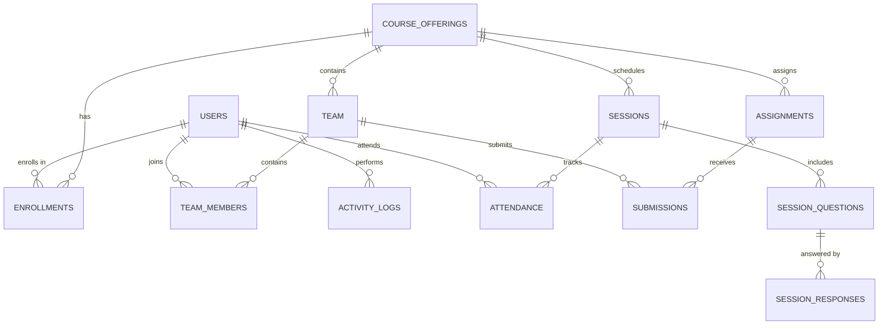

# Database Schema Reference

Complete reference for the Conductor application database schema.

## Overview

The Conductor database is built on **PostgreSQL 18** and follows a normalized relational design with:

- **15 core tables** for application data
- **13 ENUM types** for type safety
- **Comprehensive indexes** for query performance
- **Triggers** for automatic timestamp updates
- **Foreign keys** with CASCADE for referential integrity

### Core Entities



## Tables

### 1. users

Stores all users in the system (admins, instructors, TAs, students).

| Column | Type | Description |
|--------|------|-------------|
| `id` | UUID | Primary key |
| `email` | CITEXT | Unique email (case-insensitive) |
| `ucsd_pid` | TEXT | UCSD student ID |
| `name` | TEXT | Full name |
| `preferred_name` | TEXT | Preferred name |
| `major` | TEXT | Student major |
| `degree_program` | TEXT | Degree program |
| `academic_year` | INTEGER | Year in program |
| `department` | TEXT | Department affiliation |
| `class_level` | TEXT | Freshman, Sophomore, etc. |
| `primary_role` | user_role_enum | admin, instructor, student, unregistered |
| `status` | user_status_enum | active, busy, inactive |
| `institution_type` | institution_type_enum | ucsd, extension |
| `profile_url` | TEXT | Profile page URL |
| `image_url` | TEXT | Avatar/photo URL |
| `phone_number` | TEXT | Contact number |
| `github_username` | TEXT | GitHub username |
| `linkedin_url` | TEXT | LinkedIn profile |
| `google_id` | TEXT | Google OAuth identifier (unique) |
| `oauth_provider` | TEXT | OAuth provider (default: 'google') |
| `created_at` | TIMESTAMPTZ | Creation timestamp |
| `updated_at` | TIMESTAMPTZ | Last update timestamp |
| `updated_by` | UUID | User who last updated (FK to users) |
| `deleted_at` | TIMESTAMPTZ | Soft delete timestamp |

**Indexes:**
- `idx_users_email` on `email`
- `idx_users_primary_role` on `primary_role`
- `idx_users_google_id` on `google_id`

**Triggers:**
- `update_users_updated_at` - Auto-update `updated_at` on modification

---

### 2. course_offerings

Course information (typically one row for CSE 210 in single-course setup).

| Column | Type | Description |
|--------|------|-------------|
| `id` | UUID | Primary key |
| `code` | TEXT | Course code (e.g., "CSE210") |
| `name` | TEXT | Course name |
| `department` | TEXT | Department (e.g., "CSE") |
| `term` | TEXT | Term (e.g., "FA", "WI", "SP") |
| `year` | INTEGER | Year (e.g., 2025) |
| `credits` | INTEGER | Credit hours |
| `instructor_id` | UUID | Primary instructor (FK to users) |
| `start_date` | DATE | Course start date |
| `end_date` | DATE | Course end date |
| `enrollment_cap` | INTEGER | Maximum enrollment |
| `status` | course_offering_status_enum | open, closed, completed |
| `location` | TEXT | Primary location |
| `class_timings` | JSONB | Class schedule (array of times) |
| `syllabus_url` | TEXT | Syllabus link |
| `is_active` | BOOLEAN | Active flag (default: true) |
| `created_at` | TIMESTAMPTZ | Creation timestamp |
| `updated_at` | TIMESTAMPTZ | Last update timestamp |
| `created_by` | UUID | Creator (FK to users) |
| `updated_by` | UUID | Last updater (FK to users) |

**Unique Constraint:** `(code, term, year)`

**Indexes:**
- `idx_course_offerings_instructor` on `instructor_id`
- `idx_course_offerings_active` on `is_active`
- `idx_course_offerings_created_by` on `created_by`

---

### 3. enrollments

Links users to courses with their role (student, TA, tutor) and enrollment status.

| Column | Type | Description |
|--------|------|-------------|
| `id` | UUID | Primary key |
| `offering_id` | UUID | Course (FK to course_offerings) |
| `user_id` | UUID | User (FK to users) |
| `course_role` | enrollment_role_enum | student, ta, tutor, team_lead, instructor, professor |
| `status` | enrollment_status_enum | enrolled, waitlisted, dropped, completed |
| `enrolled_at` | DATE | Enrollment date |
| `dropped_at` | DATE | Drop date (if applicable) |
| `final_grade` | TEXT | Letter grade |
| `grade_marks` | DECIMAL | Numeric grade |
| `created_at` | TIMESTAMPTZ | Creation timestamp |
| `updated_at` | TIMESTAMPTZ | Last update timestamp |
| `created_by` | UUID | Creator (FK to users) |
| `updated_by` | UUID | Last updater (FK to users) |

**Unique Constraint:** `(offering_id, user_id)`

**Indexes:**
- `idx_enrollments_offering` on `offering_id`
- `idx_enrollments_user` on `user_id`
- `idx_enrollments_course_role` on `course_role`

---

### 4. team

Student teams within a course offering.

| Column | Type | Description |
|--------|------|-------------|
| `id` | UUID | Primary key |
| `offering_id` | UUID | Course (FK to course_offerings) |
| `name` | TEXT | Team name (e.g., "Team Alpha") |
| `team_number` | INTEGER | Team number |
| `leader_id` | UUID | Team leader (FK to users) |
| `status` | team_status_enum | forming, active, inactive |
| `formed_at` | DATE | Formation date |
| `created_at` | TIMESTAMPTZ | Creation timestamp |
| `updated_at` | TIMESTAMPTZ | Last update timestamp |
| `created_by` | UUID | Creator (FK to users) |
| `updated_by` | UUID | Last updater (FK to users) |

**Indexes:**
- `idx_team_offering` on `offering_id`
- `idx_team_leader` on `leader_id`

---

### 5. team_members

Team membership records.

| Column | Type | Description |
|--------|------|-------------|
| `id` | UUID | Primary key |
| `team_id` | UUID | Team (FK to team) |
| `user_id` | UUID | User (FK to users) |
| `role` | team_member_role_enum | leader, member |
| `joined_at` | DATE | Join date |
| `left_at` | DATE | Leave date (if applicable) |
| `added_by` | UUID | Who added member (FK to users) |
| `removed_by` | UUID | Who removed member (FK to users) |

**Unique Constraint:** `(team_id, user_id)`

**Indexes:**
- `idx_team_members_team` on `team_id`
- `idx_team_members_user` on `user_id`

---

### 6. sessions

Class sessions with unique access codes for attendance.

| Column | Type | Description |
|--------|------|-------------|
| `id` | UUID | Primary key |
| `offering_id` | UUID | Course (FK to course_offerings) |
| `title` | TEXT | Session title (e.g., "Lecture 5") |
| `description` | TEXT | Session description |
| `session_date` | DATE | Session date |
| `session_time` | TIME | Session time |
| `access_code` | TEXT | Unique check-in code |
| `code_expires_at` | TIMESTAMPTZ | Code expiration |
| `is_active` | BOOLEAN | Active flag (default: true) |
| `attendance_opened_at` | TIMESTAMPTZ | When attendance opened |
| `attendance_closed_at` | TIMESTAMPTZ | When attendance closed |
| `created_at` | TIMESTAMPTZ | Creation timestamp |
| `updated_at` | TIMESTAMPTZ | Last update timestamp |
| `created_by` | UUID | Creator (FK to users) |
| `updated_by` | UUID | Last updater (FK to users) |

**Indexes:**
- `idx_sessions_offering` on `offering_id`
- `idx_sessions_date` on `session_date`
- `idx_sessions_access_code` on `access_code`

---

### 7. session_questions

Questions/prompts for class sessions.

| Column | Type | Description |
|--------|------|-------------|
| `id` | UUID | Primary key |
| `session_id` | UUID | Session (FK to sessions) |
| `question_text` | TEXT | Question content |
| `question_type` | TEXT | text, multiple_choice, pulse_check |
| `question_order` | INTEGER | Display order |
| `options` | JSONB | Multiple choice options |
| `is_required` | BOOLEAN | Required flag (default: false) |
| `created_at` | TIMESTAMPTZ | Creation timestamp |
| `updated_at` | TIMESTAMPTZ | Last update timestamp |
| `created_by` | UUID | Creator (FK to users) |
| `updated_by` | UUID | Last updater (FK to users) |

**Indexes:**
- `idx_session_questions_session` on `session_id`
- `idx_session_questions_type` on `question_type`

---

### 8. session_responses

Student responses to session questions.

| Column | Type | Description |
|--------|------|-------------|
| `id` | UUID | Primary key |
| `session_id` | UUID | Session (FK to sessions) |
| `question_id` | UUID | Question (FK to session_questions) |
| `user_id` | UUID | Respondent (FK to users) |
| `response_text` | TEXT | Text response |
| `response_option` | TEXT | Selected option (multiple choice) |
| `submitted_at` | TIMESTAMPTZ | Submission timestamp |
| `updated_at` | TIMESTAMPTZ | Last update timestamp |

**Unique Constraint:** `(session_id, question_id, user_id)`

**Indexes:**
- `idx_session_responses_session` on `session_id`
- `idx_session_responses_question` on `question_id`
- `idx_session_responses_user` on `user_id`
- `idx_session_responses_submitted` on `submitted_at`

---

### 9. attendance

Student attendance records for each session.

| Column | Type | Description |
|--------|------|-------------|
| `id` | UUID | Primary key |
| `session_id` | UUID | Session (FK to sessions) |
| `user_id` | UUID | Student (FK to users) |
| `status` | attendance_status_enum | present, absent, late, excused |
| `checked_in_at` | TIMESTAMPTZ | Check-in timestamp |
| `access_code_used` | TEXT | Access code student used |
| `created_at` | TIMESTAMPTZ | Creation timestamp |
| `updated_at` | TIMESTAMPTZ | Last update timestamp |

**Unique Constraint:** `(session_id, user_id)`

**Indexes:**
- `idx_attendance_session` on `session_id`
- `idx_attendance_user` on `user_id`
- `idx_attendance_status` on `status`
- `idx_attendance_checked_in` on `checked_in_at`

---

### 10. assignments

Course assignments (projects, homework, exams).

| Column | Type | Description |
|--------|------|-------------|
| `id` | UUID | Primary key |
| `offering_id` | UUID | Course (FK to course_offerings) |
| `title` | TEXT | Assignment title |
| `type` | assignment_type_enum | project, hw, exam, checkpoint |
| `due_date` | TIMESTAMPTZ | Due date/time |
| `late_policy` | JSONB | Late submission rules |
| `max_points` | DECIMAL | Maximum points |
| `rubric` | JSONB | Grading rubric |
| `assigned_to` | assignment_assigned_to_enum | team, individual |
| `created_at` | TIMESTAMPTZ | Creation timestamp |
| `updated_at` | TIMESTAMPTZ | Last update timestamp |
| `created_by` | UUID | Creator (FK to users) |
| `updated_by` | UUID | Last updater (FK to users) |

**Indexes:**
- `idx_assignments_offering` on `offering_id`
- `idx_assignments_due_date` on `due_date`
- `idx_assignments_created_by` on `created_by`

---

### 11. submissions

Assignment submissions and grades.

| Column | Type | Description |
|--------|------|-------------|
| `id` | UUID | Primary key |
| `assignment_id` | UUID | Assignment (FK to assignments) |
| `user_id` | UUID | Student (FK to users) |
| `team_id` | UUID | Team (FK to team, optional) |
| `submitted_at` | TIMESTAMPTZ | Submission timestamp |
| `status` | submission_status_enum | draft, submitted, graded |
| `score` | DECIMAL | Points earned |
| `feedback` | TEXT | Grader feedback |
| `files` | JSONB | Submitted files metadata |
| `graded_by` | UUID | Grader (FK to users) |
| `graded_at` | TIMESTAMPTZ | Grading timestamp |
| `created_at` | TIMESTAMPTZ | Creation timestamp |
| `updated_at` | TIMESTAMPTZ | Last update timestamp |
| `updated_by` | UUID | Last updater (FK to users) |

**Check Constraint:** Either `team_id` or `user_id` must be set (but not both for individual assignments)

**Indexes:**
- `idx_submissions_assignment` on `assignment_id`
- `idx_submissions_user` on `user_id`
- `idx_submissions_team` on `team_id`
- `idx_submissions_status` on `status`
- `idx_submissions_graded_by` on `graded_by`

---

### 12. activity_logs

Audit trail of all user actions.

| Column | Type | Description |
|--------|------|-------------|
| `id` | UUID | Primary key |
| `user_id` | UUID | User (FK to users) |
| `offering_id` | UUID | Course context (FK to course_offerings, optional) |
| `action_type` | activity_action_type_enum | login, logout, submit_assignment, etc. |
| `metadata` | JSONB | Additional action details |
| `created_at` | TIMESTAMPTZ | Action timestamp |

**Indexes:**
- `idx_activity_logs_user` on `user_id`
- `idx_activity_logs_offering` on `offering_id`
- `idx_activity_logs_action_type` on `action_type`
- `idx_activity_logs_created_at` on `created_at`

---

### 13. auth_logs

Authentication events (login, logout, etc.).

| Column | Type | Description |
|--------|------|-------------|
| `id` | UUID | Primary key |
| `event_type` | TEXT | Event type (e.g., "login", "logout") |
| `message` | TEXT | Event message |
| `user_email` | CITEXT | User email |
| `ip_address` | TEXT | IP address |
| `user_id` | UUID | User (FK to users, nullable) |
| `path` | TEXT | Request path |
| `metadata` | JSONB | Additional event data |
| `created_at` | TIMESTAMPTZ | Event timestamp |

**Indexes:**
- `idx_auth_logs_user_email` on `user_email`
- `idx_auth_logs_user_id` on `user_id`
- `idx_auth_logs_event_type` on `event_type`
- `idx_auth_logs_created_at` on `created_at`

---

### 14. whitelist

Approved extension students who can access the system.

| Column | Type | Description |
|--------|------|-------------|
| `id` | UUID | Primary key |
| `email` | CITEXT | Email (unique, case-insensitive) |
| `approved_by` | TEXT | Approver name |
| `approved_at` | TIMESTAMPTZ | Approval timestamp |
| `created_at` | TIMESTAMPTZ | Creation timestamp |

**Indexes:**
- `idx_whitelist_email` on `email`

---

### 15. access_requests

Pending access requests from non-UCSD users.

| Column | Type | Description |
|--------|------|-------------|
| `id` | UUID | Primary key |
| `email` | CITEXT | Requester email (unique) |
| `reason` | TEXT | Access reason |
| `requested_at` | TIMESTAMPTZ | Request timestamp |
| `created_at` | TIMESTAMPTZ | Creation timestamp |

**Indexes:**
- `idx_access_requests_email` on `email`
- `idx_access_requests_requested_at` on `requested_at`

---

## ENUM Types

### user_role_enum
Values: `admin`, `instructor`, `student`, `unregistered`

### user_status_enum
Values: `active`, `busy`, `inactive`

### institution_type_enum
Values: `ucsd`, `extension`

### enrollment_role_enum
Values: `student`, `ta`, `tutor`, `team_lead`, `instructor`, `professor`

### enrollment_status_enum
Values: `enrolled`, `waitlisted`, `dropped`, `completed`

### course_offering_status_enum
Values: `open`, `closed`, `completed`

### assignment_type_enum
Values: `project`, `hw`, `exam`, `checkpoint`

### assignment_assigned_to_enum
Values: `team`, `individual`

### team_status_enum
Values: `forming`, `active`, `inactive`

### team_member_role_enum
Values: `leader`, `member`

### submission_status_enum
Values: `draft`, `submitted`, `graded`

### attendance_status_enum
Values: `present`, `absent`, `late`, `excused`

### activity_action_type_enum
Values: `login`, `logout`, `submit_assignment`, `update_submission`, `join_team`, `leave_team`, `grade_submission`, `create_assignment`, `update_assignment`, `enroll`, `drop`

---

## Common Queries

### Get all students in a course

```sql
SELECT u.id, u.name, u.email, e.course_role, e.status
FROM users u
JOIN enrollments e ON u.id = e.user_id
WHERE e.offering_id = :offering_id
  AND e.status = 'enrolled'
ORDER BY u.name;
```

### Get team members with details

```sql
SELECT 
  u.id,
  u.name,
  u.email,
  tm.role AS team_role,
  tm.joined_at
FROM team_members tm
JOIN users u ON tm.user_id = u.id
WHERE tm.team_id = :team_id
  AND tm.left_at IS NULL
ORDER BY tm.role DESC, u.name;
```

### Get attendance statistics for a student

```sql
SELECT 
  COUNT(*) FILTER (WHERE status = 'present') AS present,
  COUNT(*) FILTER (WHERE status = 'late') AS late,
  COUNT(*) FILTER (WHERE status = 'absent') AS absent,
  COUNT(*) FILTER (WHERE status = 'excused') AS excused,
  COUNT(*) AS total
FROM attendance
WHERE user_id = :user_id;
```

### Get upcoming assignments

```sql
SELECT 
  a.id,
  a.title,
  a.type,
  a.due_date,
  a.max_points
FROM assignments a
WHERE a.offering_id = :offering_id
  AND a.due_date > NOW()
ORDER BY a.due_date ASC;
```

---

## Performance Considerations

1. **Indexes**: All foreign keys and frequently queried columns are indexed
2. **UUIDs**: Use `gen_random_uuid()` for better randomness than `uuid_generate_v4()`
3. **CITEXT**: Email columns use case-insensitive text for efficient queries
4. **Timestamps**: Use `TIMESTAMPTZ` for timezone-aware timestamps
5. **JSONB**: Use for flexible schema (metadata, options) with GIN indexes when needed
6. **CASCADE**: Foreign keys use `ON DELETE CASCADE` for automatic cleanup

## Best Practices

- **Soft Deletes**: Use `deleted_at` timestamp instead of hard deletes for users
- **Audit Trail**: `created_by`, `updated_by`, `created_at`, `updated_at` on most tables
- **Constraints**: Use ENUM types for type safety
- **Unique Constraints**: Prevent duplicate enrollments, team memberships, etc.
- **Triggers**: Automatic `updated_at` timestamp management

---

**See Also:**
- [Database Migrations](migrations.md) - How to modify the schema
- [ER Diagram](er-diagram.md) - Visual database structure
- [Database Overview](overview.md) - Architecture and design decisions
