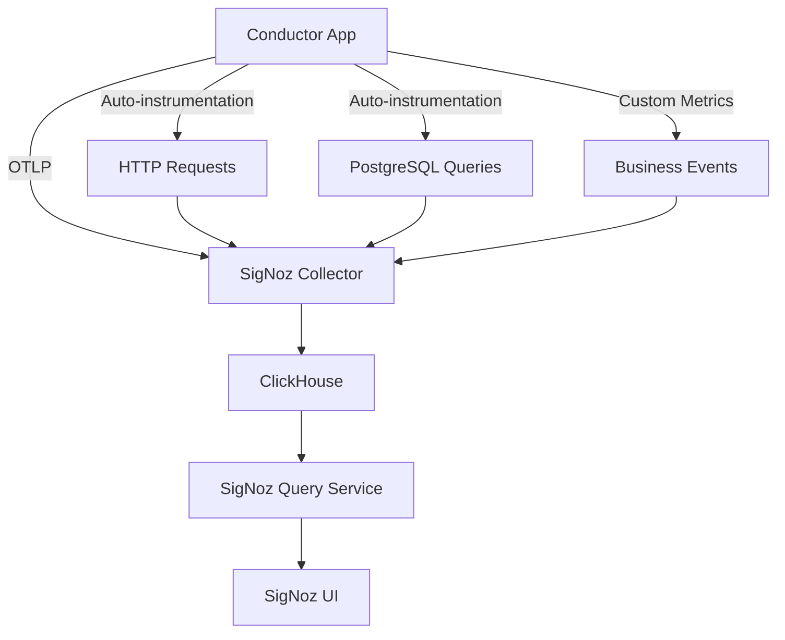

# Application Monitoring & Observability

Comprehensive guide to monitoring the Conductor application using OpenTelemetry and SigNoz for metrics, traces, and logs.

---

## Table of Contents

1. [Overview](#overview)
2. [Architecture](#architecture)
3. [Setup](#setup)
4. [Usage](#usage)
5. [Monitoring Best Practices](#monitoring-best-practices)
6. [Troubleshooting](#troubleshooting)
7. [Production Deployment](#production-deployment)

---

## Overview

The Conductor application uses **OpenTelemetry SDK** to collect metrics and traces, which are exported to **SigNoz** for visualization and analysis. This integration is embedded into the application code to provide comprehensive observability.

> **Technology Selection**: See [ADR-0007: Observability Stack](../adrs/adr-0007-observability-stack.md) for the decision rationale and alternatives considered.

### Key Benefits

-  **Real-time Metrics** - Track application performance and business KPIs
-  **Distributed Tracing** - Debug requests across the entire stack
-  **Custom Dashboards** - Visualize application-specific metrics
-  **Alerting** - Get notified of performance issues and errors
-  **Business Insights** - Track user behavior and feature usage

### Technology Stack

| Component | Technology | Purpose |
|-----------|-----------|---------|
| **Instrumentation** | OpenTelemetry SDK | Collect metrics and traces |
| **Protocol** | OTLP (OpenTelemetry Protocol) | Export telemetry data |
| **Backend** | SigNoz | Store, query, and visualize data |
| **Storage** | ClickHouse | Time-series database |

---

## Architecture

### System Components



### Application Integration

The monitoring is integrated at three levels:

1. **`src/instrumentation.js`** - OpenTelemetry SDK initialization
   - Configures NodeSDK with auto-instrumentation
   - Exports metrics and traces to SigNoz via OTLP protocol
   - Defines custom metrics for application-specific monitoring

2. **`src/middleware/metrics-middleware.js`** - Express middleware
   - Captures HTTP request metrics (count, duration, errors)
   - Provides tracking functions for business events
   - Tracks logins, DB queries, journal entries, attendance

3. **`src/server.js`** - Integration point
   - Imports instrumentation FIRST (before any other modules)
   - Adds metrics middleware to Express app
   - Ensures telemetry is captured from startup

### Custom Metrics

The application tracks comprehensive custom metrics:

| Metric Name | Type | Description | Labels |
| ----------- | ---- | ----------- | ------ |
| `http.requests` | Counter | Total HTTP requests | method, route, status |
| `http.request.duration` | Histogram | Request latency (ms) | method, route |
| `user.logins` | Counter | Login events | status (success/failure) |
| `db.queries` | Counter | Database queries | operation (SELECT/INSERT/UPDATE/DELETE) |
| `db.query.duration` | Histogram | Query execution time (ms) | operation |
| `api.errors` | Counter | API errors | type, endpoint |
| `active.sessions` | Gauge | Active user sessions | - |
| `journal.entries` | Counter | Journal entries created | role (student/instructor/TA/tutor) |
| `attendance.records` | Counter | Attendance records | status (present/absent/late/excused) |

### Auto-Instrumentation

OpenTelemetry automatically instruments:

- **HTTP/HTTPS** - All incoming and outgoing HTTP requests
- **Express.js** - Middleware, route handlers, error handlers
- **PostgreSQL** - All database queries via `pg` library
- **File System** - File I/O operations

---

## Setup

### Prerequisites

- Node.js 18+ (already installed)
- PostgreSQL (already installed)
- Docker Desktop (for local SigNoz)
- SigNoz instance (local or cloud)

### Option 1: Local SigNoz Setup (Docker)

Perfect for development and testing.

#### 1. Install Docker Desktop

Download from [https://www.docker.com/products/docker-desktop/](https://www.docker.com/products/docker-desktop/)

```powershell
# Verify installation
docker --version
```

#### 2. Clone SigNoz Repository

```powershell
cd $HOME
git clone https://github.com/SigNozHQ/signoz.git
cd signoz/deploy
```

#### 3. Start SigNoz

```powershell
docker compose -f docker/clickhouse-setup/docker-compose.yaml up -d
```

**Services started**:
- `signoz-otel-collector` - Port 4318 (OTLP HTTP), 4317 (OTLP gRPC)
- `signoz-query-service` - Backend API
- `signoz-frontend` - Port 3301 (UI)
- `clickhouse` - Time-series database

#### 4. Verify SigNoz

```powershell
# Check containers are running
docker ps

# Access SigNoz UI
# Open browser to http://localhost:3301
```

**First-time setup**:
1. Navigate to http://localhost:3301
2. Create admin account (first user becomes admin)
3. SigNoz is ready to receive telemetry!

#### 5. Stop SigNoz (when done)

```powershell
cd $HOME/signoz/deploy
docker compose -f docker/clickhouse-setup/docker-compose.yaml down
```

---

### Option 2: SigNoz Cloud

Perfect for production and shared environments.

1. **Sign up** at [https://signoz.io/teams/](https://signoz.io/teams/)
2. **Get credentials**:
   - OTLP endpoint: `https://ingest.{region}.signoz.cloud:443`
   - Access token: From SigNoz Cloud settings
3. **Use cloud endpoint** in configuration below

---

### Application Configuration

#### 1. Environment Variables

Copy `.env.example` to `.env` (if not already done):

```powershell
Copy-Item .env.example .env
```

#### 2. Local Development Configuration

Edit `.env` file:

```env
# SigNoz Configuration
SIGNOZ_ENDPOINT=http://localhost:4318
SERVICE_NAME=conductor-app
ENVIRONMENT=development
```

#### 3. SigNoz Cloud Configuration

For cloud deployment, update `.env`:

```env
# SigNoz Cloud Configuration
SIGNOZ_ENDPOINT=https://ingest.{region}.signoz.cloud:443
SERVICE_NAME=conductor-app
ENVIRONMENT=production
SIGNOZ_ACCESS_TOKEN=your-access-token-here
```

**Configuration Variables**:

| Variable | Description | Example |
|----------|-------------|---------|
| `SIGNOZ_ENDPOINT` | SigNoz collector endpoint | `http://localhost:4318` |
| `SERVICE_NAME` | Service identifier in SigNoz | `conductor-app` |
| `ENVIRONMENT` | Deployment environment | `development`, `staging`, `production` |
| `SIGNOZ_ACCESS_TOKEN` | Cloud authentication token | `xxxxx-xxxxx-xxxxx` (cloud only) |

---

## Usage

### Starting the Application

Metrics collection is **automatic**. Just start the server normally:

```powershell
npm run dev
```

or

```powershell
node src/server.js
```

**What happens on startup**:

```text
OpenTelemetry SDK initialized successfully
 Service: conductor-app
 Exporting to: http://localhost:4318
 Environment: development
```

The instrumentation will:
- Initialize on app startup
- Automatically track all HTTP requests
- Export metrics to SigNoz every 10 seconds
- Log initialization success/failure

---

### Viewing Metrics in SigNoz

#### 1. Access SigNoz Dashboard

**Local**: http://localhost:3301  
**Cloud**: Your SigNoz cloud URL

#### 2. Navigate Dashboards

**Services Tab**:
- View service health and latency
- See error rates and throughput
- Compare performance across time periods

**Traces Tab**:
- View distributed traces of requests
- Debug slow endpoints
- See database query performance

**Metrics Tab**:
- Custom metrics dashboard
- Create visualizations
- Set up alerts

**Logs Tab** (if configured):
- Application logs
- Error logs
- Structured logging

#### 3. SigNoz Metrics Explorer


*SigNoz Metrics Explorer showing all collected metrics including HTTP server duration, database operations, memory usage, and garbage collection metrics*

#### 4. Database Performance Visualization


*Time series visualization of database client operation duration, showing performance trends over time*

#### 5. Create Custom Dashboards

**Example: API Performance Dashboard**

1. Click **Dashboards** → **New Dashboard**
2. Add panels for:
   - `http.request.duration` (Histogram) - Request latency percentiles
   - `http.requests` (Counter) - Requests per second by route
   - `api.errors` (Counter) - Error rate by endpoint
3. Filter by labels: `method`, `route`, `status`
4. Save dashboard

**Example: Business Metrics Dashboard**

1. Create new dashboard
2. Add panels for:
   - `user.logins` - Login trends (success vs failure)
   - `active.sessions` - Concurrent users
   - `journal.entries` - Journal usage by role
   - `attendance.records` - Attendance rates
3. Group by labels: `role`, `status`

---

### Adding Custom Tracking

Track custom business events by importing tracking functions:

```javascript
import { 
  trackLogin, 
  trackDatabaseQuery, 
  trackJournalEntry, 
  trackAttendance 
} from './middleware/metrics-middleware.js';
```

#### Example 1: Track Login Events

```javascript
app.post('/auth/login', async (req, res) => {
  try {
    const user = await authenticateUser(req.body);
    trackLogin(user.email, 'success');
    res.json({ success: true, user });
  } catch (error) {
    trackLogin(req.body.email, 'failure');
    res.status(401).json({ error: 'Invalid credentials' });
  }
});
```

#### Example 2: Track Database Queries

```javascript
app.get('/users', async (req, res) => {
  const startTime = Date.now();
  try {
    const result = await pool.query('SELECT * FROM users WHERE deleted_at IS NULL');
    trackDatabaseQuery('SELECT', Date.now() - startTime);
    res.json(result.rows);
  } catch (error) {
    trackDatabaseQuery('SELECT', Date.now() - startTime, error);
    res.status(500).json({ error: 'Database error' });
  }
});
```

#### Example 3: Track Journal Entries

```javascript
app.post('/journal', async (req, res) => {
  const entry = await createJournalEntry(req.body);
  trackJournalEntry(req.user.role); // 'student', 'instructor', 'TA', 'tutor'
  res.json(entry);
});
```

#### Example 4: Track Attendance

```javascript
app.post('/attendance', async (req, res) => {
  const record = await markAttendance(req.body);
  trackAttendance(record.status); // 'present', 'absent', 'late', 'excused'
  res.json(record);
});
```

---

## Monitoring Best Practices

### Key Metrics to Monitor

#### 1. Performance Metrics

| Metric | Target | Alert Threshold |
|--------|--------|-----------------|
| **HTTP request duration (p50)** | < 200ms | > 500ms |
| **HTTP request duration (p95)** | < 500ms | > 1000ms |
| **HTTP request duration (p99)** | < 1000ms | > 2000ms |
| **Database query duration (p95)** | < 100ms | > 500ms |
| **Error rate** | < 1% | > 5% |

#### 2. Business Metrics

| Metric | Purpose | Alert Example |
|--------|---------|---------------|
| **Login success/failure ratio** | Authentication health | Failure rate > 10% |
| **Active sessions** | User engagement | Sudden drops > 50% |
| **Journal entries per day** | Feature usage | < 10 entries/day |
| **Attendance rate** | Student engagement | < 70% present |

#### 3. System Health

| Metric | Normal Range | Action Required |
|--------|--------------|-----------------|
| **Request throughput** | 10-100 req/sec | > 1000 req/sec (investigate) |
| **Error rate** | < 1% | > 5% (investigate) |
| **Database connections** | 5-20 | > 80 (pool exhausted) |
| **Memory usage** | < 500MB | > 1GB (memory leak) |

---

### Setting Up Alerts

Create alerts in SigNoz for critical conditions:

#### Alert 1: High Error Rate

```yaml
Metric: http.requests
Condition: status >= 500
Threshold: Count > 10 in 5 minutes
Action: Notify DevOps team
```

#### Alert 2: Slow API Response

```yaml
Metric: http.request.duration
Condition: p95 > 1000ms
Threshold: For 5 consecutive minutes
Action: Notify on-call engineer
```

#### Alert 3: Login Failures Spike

```yaml
Metric: user.logins
Condition: status = 'failure'
Threshold: Count > 10 per minute
Action: Security alert
```

#### Alert 4: Database Performance Degradation

```yaml
Metric: db.query.duration
Condition: p95 > 500ms
Threshold: For 10 consecutive minutes
Action: Investigate database
```

---

### Dashboard Examples

#### Developer Dashboard

**Purpose**: Monitor application health during development

**Panels**:
1. HTTP requests per second (by route)
2. Request latency (p50, p95, p99)
3. Error count (last hour)
4. Database query count
5. Active sessions

#### Operations Dashboard

**Purpose**: Production monitoring and incident response

**Panels**:
1. Service uptime (last 24h)
2. Error rate trend
3. Request throughput
4. Database connection pool
5. Memory and CPU usage

#### Product Dashboard

**Purpose**: Business metrics and user behavior

**Panels**:
1. Daily active users
2. Login success rate
3. Journal entries (by role)
4. Attendance rate
5. Feature usage heatmap

---

## Troubleshooting

### Issue 1: Metrics Not Appearing in SigNoz

#### Symptoms
- No data in SigNoz dashboards
- Service not listed in Services tab

#### Solution Steps

**1. Check SigNoz is Running**

```powershell
docker ps
```

Expected output should include:
- `signoz-otel-collector`
- `signoz-query-service`
- `signoz-frontend`
- `clickhouse`

**2. Verify Endpoint Configuration**

```powershell
# Check .env file
Get-Content .env | Select-String "SIGNOZ"
```

Should show:
```env
SIGNOZ_ENDPOINT=http://localhost:4318
```

**3. Check Application Logs**

Look for initialization message:
```text
OpenTelemetry SDK initialized successfully
```

**4. Test Connectivity**

```powershell
# Test if SigNoz collector is reachable
curl http://localhost:4318/v1/metrics
```

**5. Check Firewall**

Ensure port 4318 is not blocked:
```powershell
Test-NetConnection -ComputerName localhost -Port 4318
```

---

### Issue 2: Instrumentation Not Loading

#### Symptoms
- No telemetry data collected
- No initialization log message

#### Solution Steps

**1. Verify Import Order in server.js**

**Critical**: Instrumentation MUST be imported first!

```javascript
// CORRECT - instrumentation is FIRST
import "./instrumentation.js";
import express from 'express';
// ... other imports

// WRONG - other imports before instrumentation
import express from 'express';
import "./instrumentation.js"; // Too late!
```

**2. Check Dependencies**

```powershell
npm ls @opentelemetry/sdk-node
```

Should show installed version. If missing:

```powershell
npm install @opentelemetry/sdk-node @opentelemetry/auto-instrumentations-node
```

**3. Verify Environment Variables**

```powershell
# Check required variables
node -e "console.log(process.env.SIGNOZ_ENDPOINT)"
node -e "console.log(process.env.SERVICE_NAME)"
```

---

### Issue 3: High Memory Usage

#### Symptoms
- Application using > 500MB memory
- Memory grows over time

#### Normal Behavior

OpenTelemetry SDK uses ~20-50MB of memory (expected overhead).

#### If Excessive Memory Usage

**1. Reduce Metric Export Frequency**

Edit `src/instrumentation.js`:

```javascript
periodicExportingMetricReader: {
  exportIntervalMillis: 30000, // Change from 10s to 30s
}
```

**2. Disable Unused Auto-Instrumentation**

```javascript
instrumentations: [
  getNodeAutoInstrumentations({
    '@opentelemetry/instrumentation-fs': { enabled: false }, // Disable file system
  }),
],
```

**3. Monitor Memory Usage**

```javascript
// Add to your code
setInterval(() => {
  const used = process.memoryUsage();
  console.log(`Memory: ${Math.round(used.heapUsed / 1024 / 1024)}MB`);
}, 60000); // Every minute
```

---

### Issue 4: Missing Traces

#### Symptoms
- Metrics appear, but no traces
- Traces tab is empty

#### Solution Steps

**1. Check Sampling**

Ensure sampling is enabled in `instrumentation.js`:

```javascript
sampler: new AlwaysOnSampler(), // For development
```

**2. Verify OTLP Exporter**

Check both metrics AND traces exporters are configured:

```javascript
traceExporter: new OTLPTraceExporter({
  url: process.env.SIGNOZ_ENDPOINT + '/v1/traces',
}),
```

---

## Production Deployment

### Environment Configuration

For production deployment, update `.env`:

```env
NODE_ENV=production
ENVIRONMENT=production
SIGNOZ_ENDPOINT=https://ingest.{region}.signoz.cloud:443
SIGNOZ_ACCESS_TOKEN=your-production-token
SERVICE_NAME=conductor-app
```

### Performance Considerations

| Metric | Impact | Notes |
|--------|--------|-------|
| **Latency** | +1-5ms per request | Negligible overhead |
| **Memory** | +20-50MB | Constant overhead |
| **Network** | ~10KB/sec | Exported every 10 seconds |
| **CPU** | < 1% | Minimal processing |

**Recommendation**: Performance impact is minimal and acceptable for production.

---

### Security Best Practices

#### 1. Network Security

- **Never expose SigNoz endpoint publicly** - Use firewall rules
- **Use HTTPS** for cloud endpoints
- **Restrict collector access** to application servers only

#### 2. Access Control

- **Rotate access tokens** regularly (if using SigNoz Cloud)
- **Use separate tokens** for dev/staging/production
- **Limit token permissions** to minimum required

#### 3. Data Privacy

- **Sanitize PII** from traces and metrics (emails, passwords, etc.)
- **Redact sensitive data** in logs
- **Configure data retention** per compliance requirements

**Example: Sanitize PII**

```javascript
// In instrumentation.js
spanProcessor: new SimpleSpanProcessor({
  spanExporter: new OTLPTraceExporter({
    // Redact sensitive attributes
    attributeFilter: (key, value) => {
      if (key.includes('password') || key.includes('email')) {
        return '[REDACTED]';
      }
      return value;
    }
  })
})
```

---

### Scaling Considerations

#### For High-Traffic Deployments (> 1000 req/sec)

1. **Use Batch Span Processor**

```javascript
spanProcessor: new BatchSpanProcessor(exporter, {
  maxQueueSize: 2048,
  maxExportBatchSize: 512,
  scheduledDelayMillis: 5000,
})
```

2. **Increase Export Interval**

```javascript
periodicExportingMetricReader: {
  exportIntervalMillis: 60000, // 1 minute
}
```

3. **Use Sampling**

```javascript
// Sample 10% of traces in production
sampler: new ParentBasedSampler({
  root: new TraceIdRatioBasedSampler(0.1)
})
```

---

## Related Documentation

- [CI/CD Pipeline](ci-cd.md) - Automated deployment with monitoring
- [Backend Overview](../backend/overview.md) - Backend architecture
- [Database Schema](../database/schema.md) - Database structure
- [API Reference](../backend/api-reference.md) - API endpoints

---

## Quick Reference

### Important URLs

| Service | Local | Cloud |
|---------|-------|-------|
| **SigNoz UI** | http://localhost:3301 | https://your-org.signoz.cloud |
| **OTLP Collector** | http://localhost:4318 | https://ingest.{region}.signoz.cloud:443 |
| **Application** | https://localhost:8443 | Production URL |

### Important Files

| File | Purpose |
|------|---------|
| `src/instrumentation.js` | OpenTelemetry SDK configuration |
| `src/middleware/metrics-middleware.js` | Custom metrics and tracking |
| `src/server.js` | Integration point |
| `.env` | Configuration variables |

### Common Commands

```powershell
# Start SigNoz (local)
cd $HOME/signoz/deploy
docker compose -f docker/clickhouse-setup/docker-compose.yaml up -d

# Stop SigNoz (local)
docker compose -f docker/clickhouse-setup/docker-compose.yaml down

# Start application with monitoring
npm run dev

# Check OpenTelemetry dependencies
npm ls @opentelemetry

# Test SigNoz connectivity
curl http://localhost:4318/v1/metrics
```

---

**Last Updated**: December 10, 2025  
**Maintained by**: Team04-UCSD-CSE210
