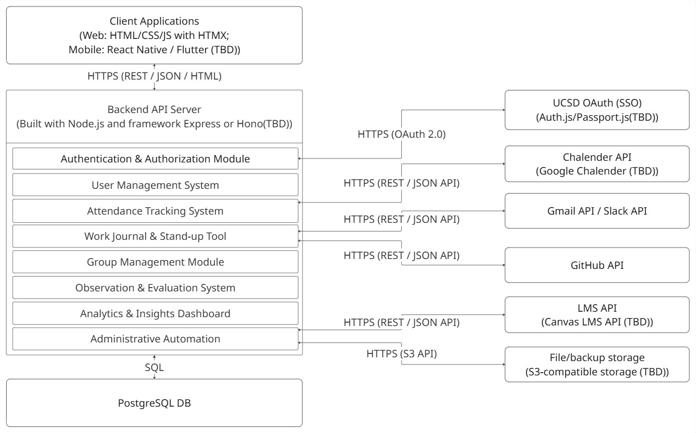

# **System Architecture – Conductor App**

## **1. Overview**

The **Conductor App** is a web and mobile platform designed to support course management,
attendance tracking, and collaborative journaling for instructors, TAs, and students. The system
integrates authentication, communication, analytics, and automation services into a unified
backend, supporting both browser and mobile clients through RESTful APIs.

This document outlines the overall **system architecture**, including the **technology stack**,
**data flow**, and **external service integrations** based on the design diagram.

---

## **2. Diagram Reference**

The following diagram illustrates the system architecture and module interactions:

---

## **3. Architecture Overview**

The system follows a **modular client-server architecture**, with a **Node.js backend API** that
communicates with a **PostgreSQL database** and multiple **external services** over HTTPS.

Client applications (web and mobile) interact with the backend via **REST / JSON / HTML** requests.
Each major feature (e.g., Attendance, Work Journal, Analytics) is implemented as a backend module
that may interact with external APIs as needed.

---

## **4. Client Applications**

### **4.1 Web Client**

- Built with standard **HTML / CSS / JS** using **HTMX** for dynamic interactivity.
- Communicates with the backend via **HTTPS (REST / JSON / HTML)**.
- Provides interfaces for:
  - Attendance tracking
  - Class management
  - Stand-up / work journal entries
  - Analytics dashboard

### **4.2 Mobile Client**

- Planned for **React Native or Flutter (TBD)**.
- Mirrors core web functionality for mobile accessibility.
- Connects to the same backend endpoints as the web client.

---

## **5. Backend API Server**

**Implementation:** Node.js with **Express or Hono (TBD)** framework.

The backend serves as the application’s central logic and communication layer.  
It exposes REST endpoints, enforces authentication, stores persistent data, and manages integration with external APIs.

### **5.1 Modules**

| Module | Description |
| --------- | ----------- |
| **Authentication & Authorization** | Integrates UCSD OAuth (via Auth.js or Passport.js TBD) for SSO login. Manages role-based access control (Instructor, TA, Tutor, Student Leader, Student). |
| **User Management System** | Handles user profiles, roles, and communication preferences. Supports class roster synchronization and enrollment. |
| **Attendance Tracking System** | Manages real-time attendance recording, integrates with Calendar API for session data, and stores analytics in PostgreSQL. |
| **Work Journal & Stand-Up Tool** | Enables users to log progress, emotions, and team updates. Integrates with GitHub API for automatic commit tracking and Gmail/Slack for notifications. |
| **Group Management Module** | Supports dynamic group creation, tracking, and collaboration metrics. |
| **Observation & Evaluation System** | Provides structured evaluation templates and fair grading rubrics. |
| **Analytics & Insights Dashboard** | Aggregates data for class performance, attendance trends, and engagement analysis. |
| **Administrative Automation** | Automates recurring tasks (e.g., reminders, report generation) and manages backup operations through S3-compatible storage. |

---

## **6. Database Layer**

### **PostgreSQL Database**

The system uses **PostgreSQL** as the main data store for:

- Users and roles
- Class and group structures
- Attendance records
- Journal and stand-up entries
- Evaluation data
- Analytics results

**Connection:**  

Backend communicates via **SQL** through PostgreSQL’s native driver or ORM (e.g., Prisma / Sequelize / Knex).

---

## **7. External Integrations**

| Service | Purpose | Protocol / API |
| ---------- | ---------- | -------------- |
| **UCSD OAuth (Auth.js / Passport.js)** | Handles SSO login for UCSD users. | HTTPS (OAuth 2.0) |
| **Google Calendar API** | Syncs course schedules, lecture times, and attendance sessions. | HTTPS (REST / JSON API) |
| **Gmail API / Slack API** | Sends automated notifications, reminders, and updates to users. | HTTPS (REST / JSON API) |
| **GitHub API** | Syncs journal logs with repository commits for work tracking. | HTTPS (REST / JSON API) |
| **LMS API (Canvas)** | Imports course rosters and assignment information. | HTTPS (REST / JSON API) |
| **S3-Compatible Storage** | Used for file uploads, backups, and data exports. | HTTPS (S3 API) |

---

## **8. Data Flow Summary**

1. **Client Applications** send HTTPS requests (REST/JSON/HTML) to the **Backend API Server**.  
2. **Backend API** authenticates requests using **OAuth 2.0 (UCSD SSO)**.  
3. **Backend Modules** perform business logic, interacting with:
   - **PostgreSQL DB** (SQL) for persistent data.
   - **External APIs** (Calendar, Slack, GitHub, LMS) for synchronization and automation.  
4. **Responses** are returned to the client in **JSON or HTML**.  
5. **Administrative Automation** tasks periodically trigger backup, notification, or synchronization processes.

---

## **9. Security and Access Control**

- **OAuth 2.0 (UCSD SSO)** for user authentication.
- **Role-based authorization** (Instructor, TA, Student Leader, Student) for resource access.
- **HTTPS encryption** for all communications.
- **Database roles and privileges** for secure data isolation.
- **Environment-based configurations** for secrets and API keys.

---

## **10. Scalability & Maintainability**

- Modular backend design allows isolated development of each feature.  
- PostgreSQL supports scaling via indexing, replication, and optimized query design.  
- External APIs reduce complexity for notifications, calendar sync, and backup handling.  
- Future-ready for containerized deployment (e.g., Docker + GitHub Actions CI).  
- Code quality enforced by **linting (ESLint, Markdownlint)** and **GitHub Actions CI**.

---

## **11. Summary**

The Conductor App’s system architecture integrates multiple independent modules under a unified
backend. By leveraging UCSD OAuth for identity, PostgreSQL for persistence, and standard REST APIs
for integration, the system ensures security, scalability, and extensibility.

This architecture supports future enhancements such as role expansion, analytics improvement, and
automated resource management.
